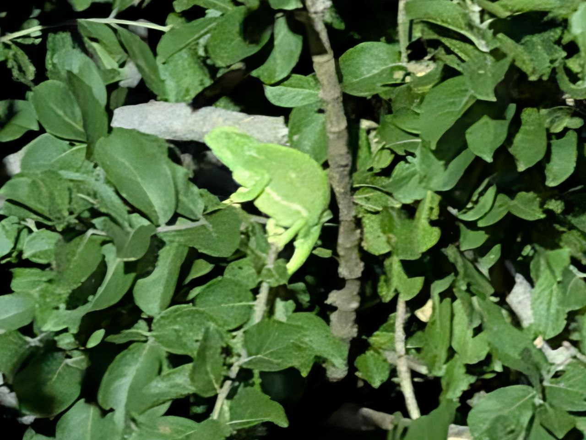

# 🇿🇦 Venerdì 6 Febbraio 2026: Arrivo e Primo Safari

## Diario della Giornata

## ... (contenuto narrativo come prima) ...

## Riepilogo Avvistamenti di Oggi

| Animale            | Conteggio  | Thumbnail                                                               |
| :----------------- | :--------- | :---------------------------------------------------------------------- |
| Antilope           | 3          | _(no photo)_                                                            |
| Camaleonte         | 1          |                        |
| Faraona            | 1          | _(no photo)_                                                            |
| Gnu                | 1          | _(no photo)_                                                            |
| Impala             | 1 (branco) | _(no photo)_                                                            |
| Kudu               | 1          | _(no photo)_                                                            |
| Lepre africana     | 4          | _(no photo)_                                                            |
| Rinoceronte        | 2+         |  |
| Steenbok           | 1          | _(no photo)_                                                            |
| Tartaruga Leopardo | 2          |                         |
| Zebra              | 5          |                  |

---

### Appunti Originali (da Viaggio-del-sudafrica)

- `20260206 09:50` Arrivo a Johannesburg.
- `20260206 13:13` Safari drive a Pilanesberg, con avvistamenti di rinoceronti e zebre.
