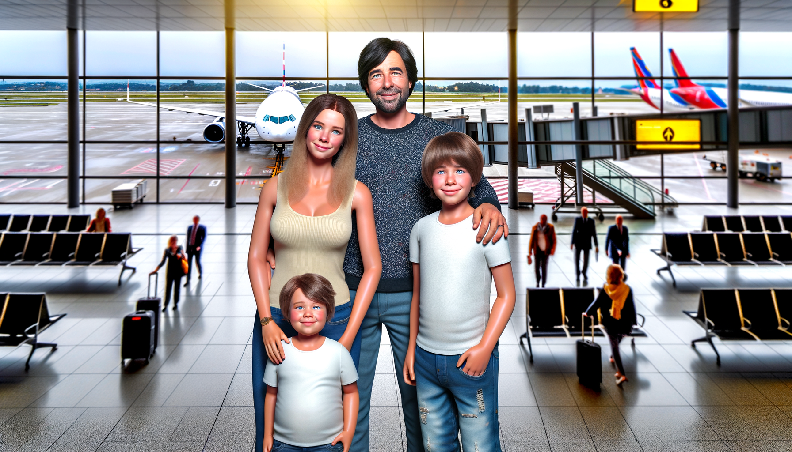
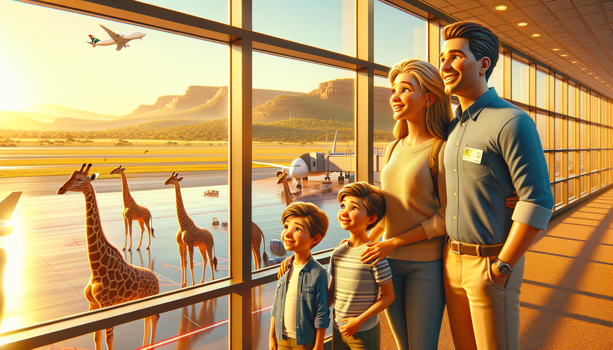
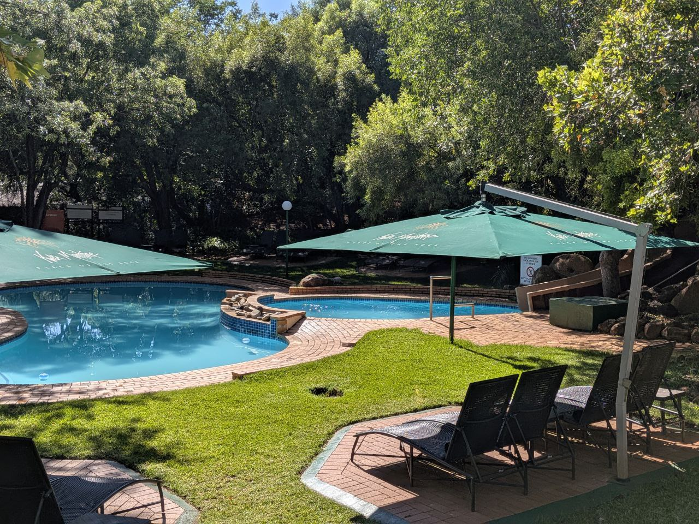
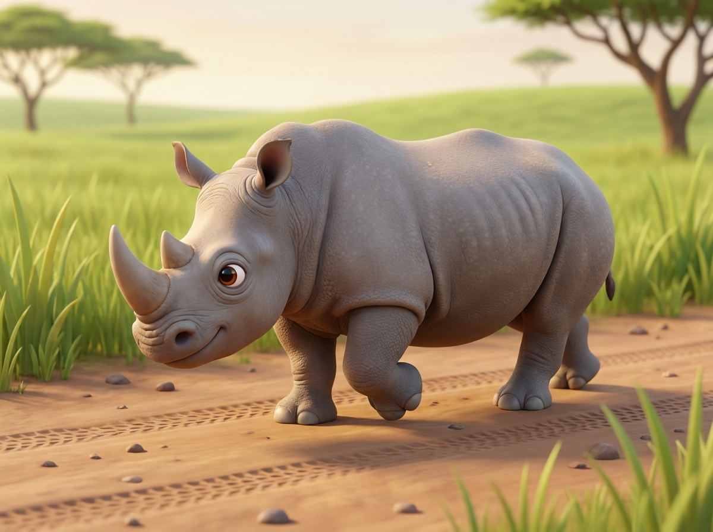
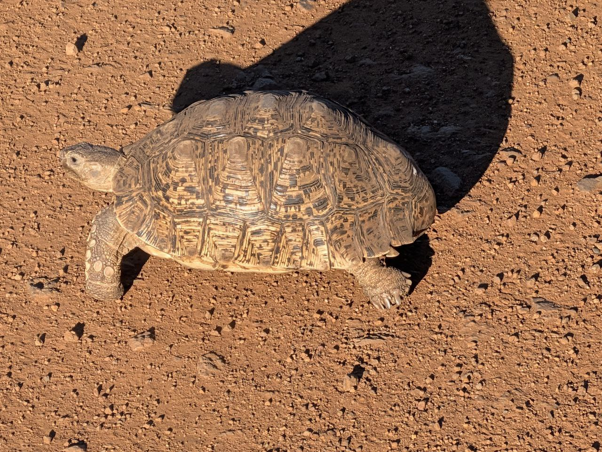
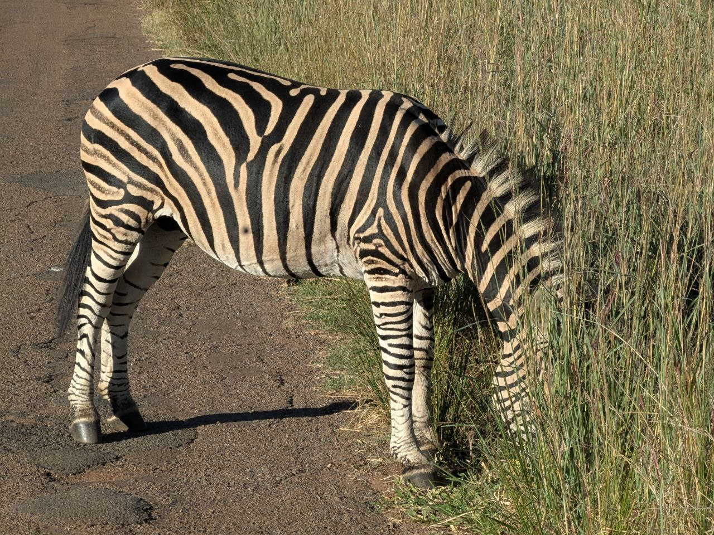

# 🇿🇦 Venerdì 6 Febbraio 2026: Arrivo e Primo Safari

[📸 Visualizza foto originali su Google Photos](https://photos.google.com/search/2026-02-06)

## Diario della Giornata

### Arrivo a Johannesburg (10:30)

Finalmente in Sudafrica! 🛬 Atterrati puntuali, recuperata l'auto a noleggio e subito in viaggio verso il Pilanesberg.

*La versione Pixar:*

### Kwa Maritane & Pancakes (15:00)

Arrivati al **Kwa Maritane Bush Lodge** e accolti con deliziosi pancake freschi. Sebi ha approvato! 🥞😋

### Tuffo in Piscina (15:45)

Mentre la mamma si preparava, ci siamo concessi un bagno veloce nella piscina riscaldata. Lo scivolo non era un granché, a detta dei ragazzi.

*La versione Pixar:*

### Safari Pomeridiano (16:30 - 19:30)

Il primo game drive non ha deluso!

**Avvistamenti:**

- 1 Gnu (Wildebeest) 🐃
- 3 Antilopi
- 2 Tartarughe Leopardo 🐢
- 5 Zebre 🦓
- 1 Kudu 🦌
- 1 Steenbok 🦌
- Branco di Impala 🦌
- 1 Faraona 🦃
- 1 Camaleonte 🦎
- 4 Lepri africane 🐇
- Rinoceronti 🦏

## Riepilogo Avvistamenti di Oggi

| Animale            | Conteggio  | Thumbnail                                                                        |
| :----------------- | :--------- | :------------------------------------------------------------------------------- |
| Antilope           | 3          | _(no photo)_                                                                     |
| Camaleonte         | 1          |                        |
| Faraona            | 1          | _(no photo)_                                                                     |
| Gnu                | 1          | _(no photo)_                                                                     |
| Impala             | 1 (branco) | _(no photo)_                                                                     |
| Kudu               | 1          | _(no photo)_                                                                     |
| Lepre africana     | 4          | _(no photo)_                                                                     |
| Rinoceronte        | 2+         |  |
| Steenbok           | 1          | _(no photo)_                                                                     |
| Tartaruga Leopardo | 2          |                         |
| Zebra              | 5          |                  |

---

### Appunti Originali (da Viaggio-del-sudafrica)

- `20260206 09:50` Arrivo a Johannesburg.
- `20260206 13:13` Safari drive a Pilanesberg, con avvistamenti di rinoceronti e zebre.
