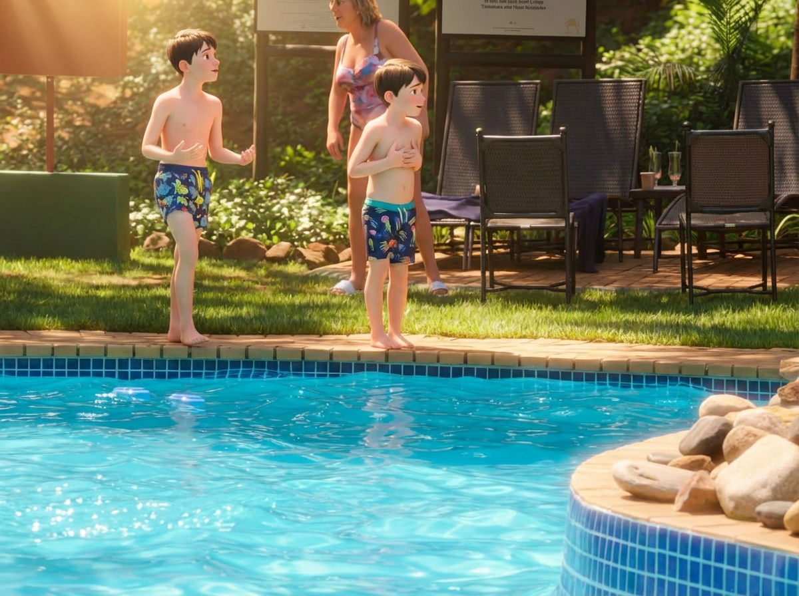
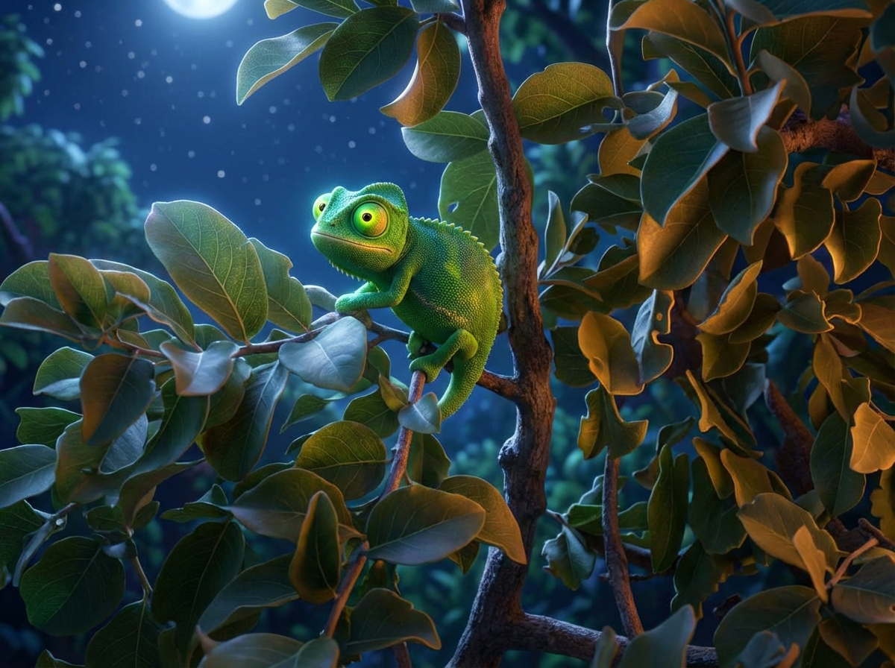

# 🇿🇦 Sabato 7 Febbraio 2026: Relax, Safari e una Cena Sotto le Stelle

Dopo le emozioni del primo giorno, ci siamo concessi una mattinata più tranquilla per ricaricare le energie.

### Mattinata di Relax
La mattinata è trascorsa in totale relax. Tra un tuffo in piscina, un po' di cazzeggio e i bambini che si divertivano un mondo, abbiamo assaporato l'atmosfera del lodge.

*La versione Pixar:*

### Safari Pomeridiano (dalle 16:30)
Nel pomeriggio, di nuovo sulla jeep per un'altra avventura. Il safari è stato ricco di sorprese, con Ale in prima linea armato di binocolo, pronto a non perdersi nulla.

La lista degli avvistamenti è stata impressionante:
- **Tsessebe** e **Red Hartebeest** (due tipi di antilopi)
- 2 **Sciacalli**
- Un **Kori Bustard** (un uccello maestoso)
- Un **Elefante** in lontananza
- Un magnifico **Kudu** con le sue corna a spirale
- 6 **Faraone**
- Un **Vervet Monkey** 🐒 (avvistato da un attentissimo Seby!)
- Un branco di **Impala** composto da soli maschi ("bachelor herd")

E poi, il momento che ha elettrizzato tutti: l'avvistamento di un **Tasso del miele** (Honey Badger)! Un animale notoriamente difficile da vedere, scovato dal nostro campione, Alessandro! L'emozione era palpabile. La foto originale era un po'... "artistica", ma la versione Pixar rende giustizia!

*La versione "migliorata":*

Abbiamo anche avuto un incontro ravvicinato e affascinante con un **Camaleonte** che attraversava lentamente la strada.

*La versione Pixar:*

### Avvistamenti Notturni e Cena BOMA
Al calar della notte, proprio mentre il buio avvolgeva la savana, abbiamo avuto un avvistamento davvero speciale: non uno, ma ben due **Gufi reali maculati** (Spotted eagle owl) appollaiati su un ramo, poco prima di arrivare per la cena.

*La versione Pixar:*

Dopo il safari, ci siamo immersi in una tradizione sudafricana: la **Boma dinner**. Una cena fantastica attorno a un grande falò sotto le stelle. L'atmosfera era magica, con musica dal vivo. Alessandro si è persino unito alla band, suonando la marimba con grande entusiasmo!

*Versione Pixar:*

*Versione Pixar:*

La serata si è conclusa alla grande e siamo rientrati a tempo di record, tutti a nanna per le 21:00. Domani ci aspetta un'altra levataccia!
