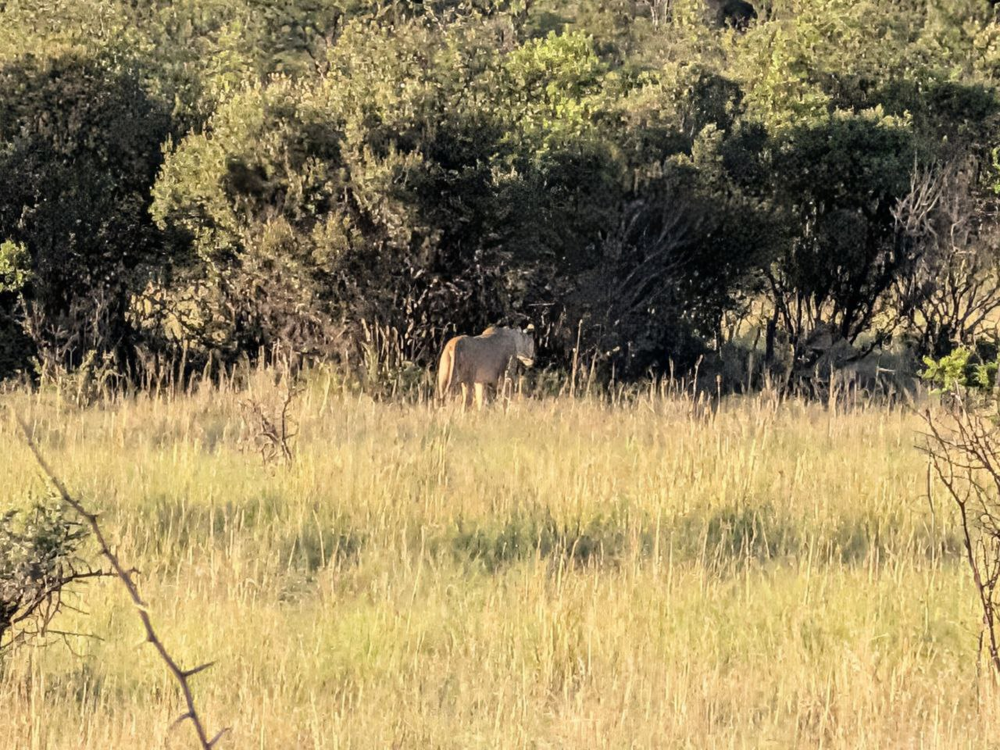

# 🇿🇦 Domenica 8 Febbraio 2026: Safari, Relax e Viaggio

... (Tutto il contenuto narrativo come sopra) ...

---
## Riepilogo Avvistamenti di Oggi

| Animale | Conteggio | Thumbnail |
| :--- | :--- | :--- |
| Elefante | 1 (branco) |  |
| Faraona | 6 | *(no photo)* |
| Gheppio | 1 | *(no photo)* |
| Gnu | 1 (branco enorme) |  |
| Grey go-away-bird | 1 |  |
| Impala | 20 |  |
| Kori Bustard | 2 |  |
| Leone | 1 branco (5) |  |
| Rinoceronte bianco | 1 |  |
| Tsessebe | 1+ |  |
| Zebra | 1 |  |
