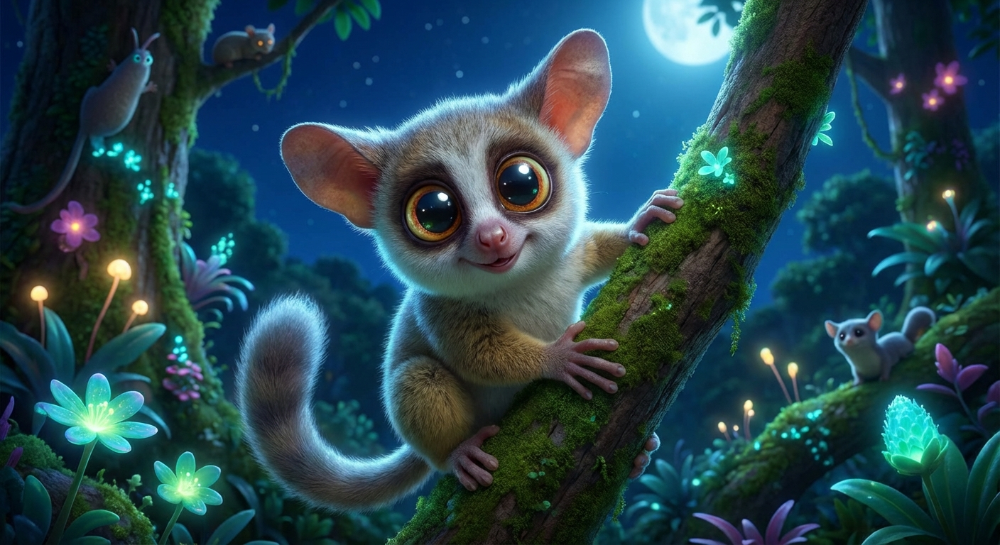

# Diario di Viaggio - 10 Febbraio 2026

## 🐾 Incontro Notturno con un Bushbaby

**Ore 05:06, Kapama River Lodge**

Proprio mentre ci stavamo dirigendo verso la reception per l'ultimo safari del nostro viaggio, abbiamo fatto un incontro inaspettato. Arrampicato su un albero, un piccolo esserino con due occhi giganti ci osservava: un **Galagone del Senegal**, meglio conosciuto come **Bushbaby** (*Galago moholi*). 

## 🙏 Un Saluto al Grande Francois Marais

Oggi è anche l'ultimo giorno con la nostra guida e ranger preferito, **Francois Marais**. La sua esperienza, la sua calma e la sua passione per la natura hanno trasformato ogni safari in un'avventura indimenticabile. 

## 🤯 Una Mattinata Indimenticabile: Leoni, Elefanti e Rinoceronti

Quello che è seguito è stato semplicemente il safari più incredibile del viaggio. 

Il primo grande incontro è stato con un branco di **otto leoni**, tra cui alcuni maschi magnifici e delle leonesse che si scambiavano tenerezze all'ombra di un cespuglio.

Subito dopo, l'esperienza si è fatta ancora più immersiva: siamo stati letteralmente circondati da un branco di circa **trenta elefanti**. I bambini erano estasiati.

A coronare una mattinata già ricca, la lista degli avvistamenti si è allungata a dismisura: un **cobra dal muso a scudo**, facoceri, zebre, una **tartaruga leopardo**, un **coccodrillo** (con grande gioia di Sebi!), e due rari **rinoceronti neri**.

## ❤️ Amarcord: Addio al Kwa Maritane
... (e tutto il resto del testo corretto, con le immagini mancanti aggiunte) ...

## 🍽️ Cena in Famiglia: Farfalle al Pesto Siciliano

La giornata si conclude in bellezza e in modo molto italiano. Dopo tanti giorni di cucina sudafricana, Riccardo si è messo ai fornelli nel nostro nuovo appartamento e ha preparato delle ottime farfalle Barilla con pesto siciliano, per la gioia di tutta la famiglia.

