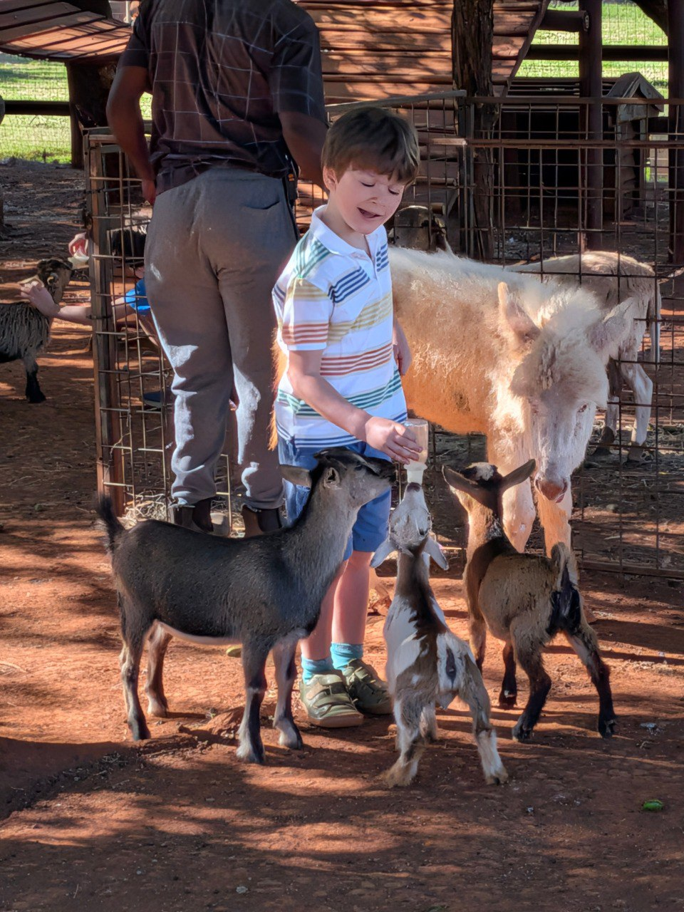
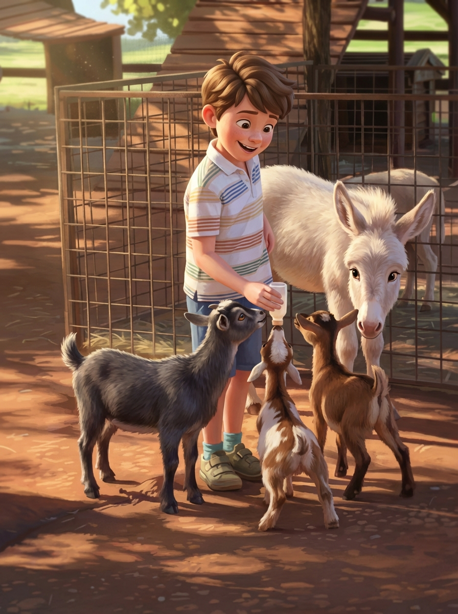
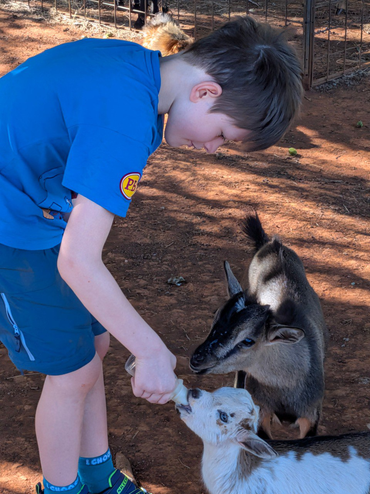
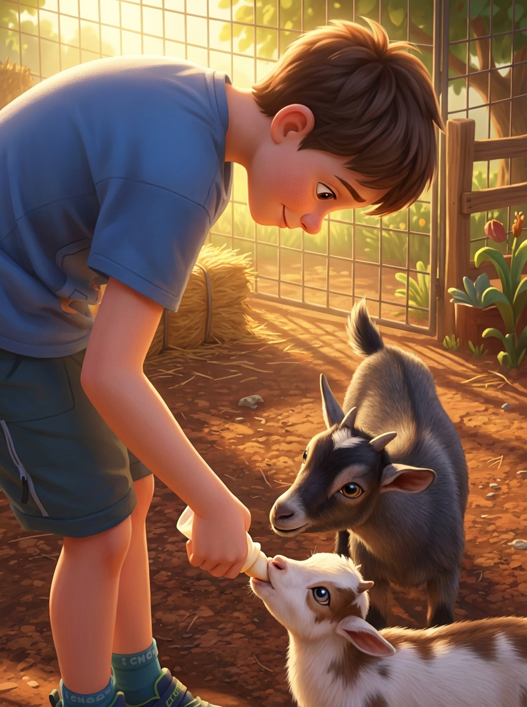
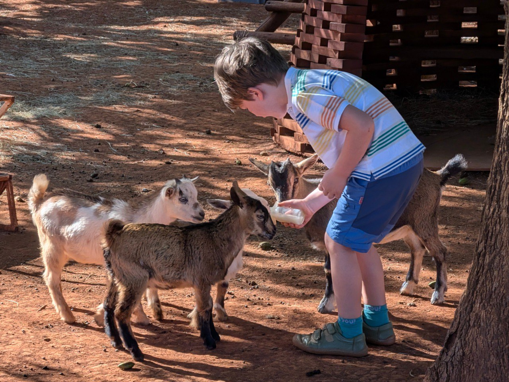
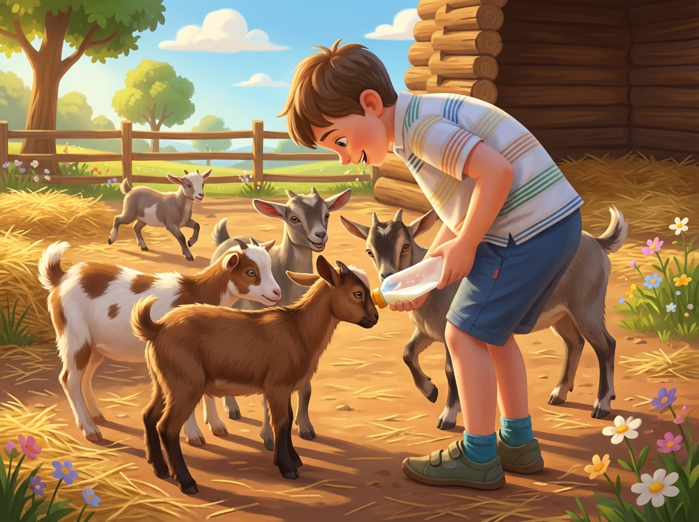
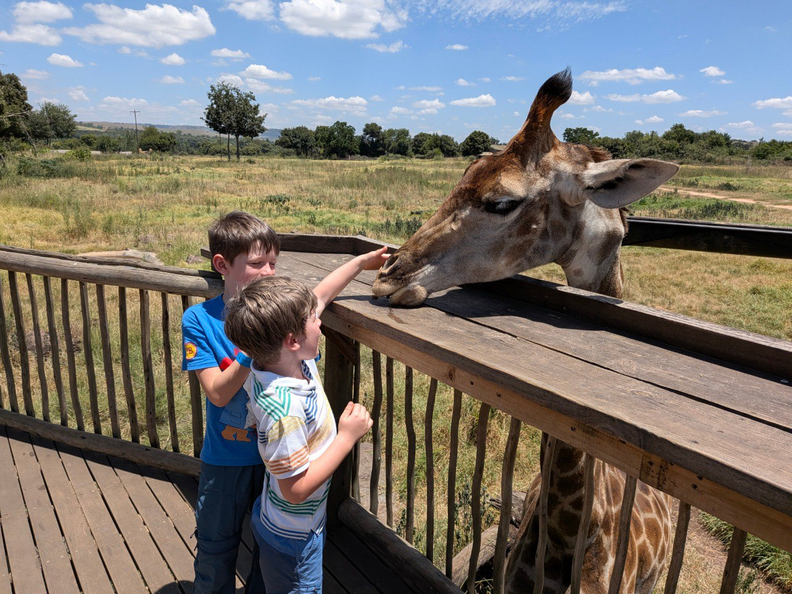
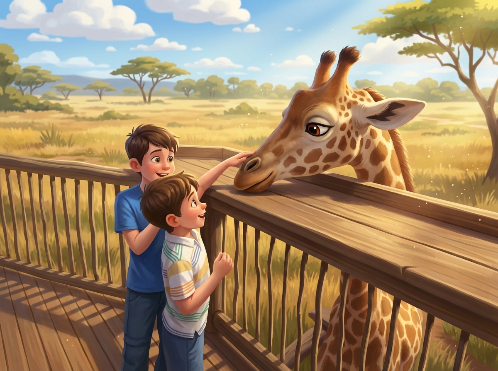

# 11 Febbraio 2026: Dalle Origini dell'Uomo alle Giraffe

[📸 Visualizza foto originali su Google Photos](https://photos.google.com/search/2026-02-11)

### Capitolo 1: Risveglio in Fattoria

La mattinata di lunedì inizia nello stesso luogo incantato dove la famiglia ha passato la notte. Dopo il risveglio, la prima attività della giornata è tornare a salutare i veri padroni di casa: non solo asini, ma anche tante piccole caprette affamate. I bambini si divertono a dare loro il latte con il biberon, un'esperienza indimenticabile prima di partire per la grande avventura culturale della giornata.

### Capitolo 2: Una Delusione Storica

La tappa principale della giornata è la visita al **Cradle of Humankind** e alle **Sterkfontein Caves**. Nonostante le grandi aspettative per un tuffo nella storia dell'umanità, l'esperienza si rivela una delusione totale per tutta la famiglia.

*(Attendo foto dalle caverne, se ce ne sono...)*

### Capitolo 3: Pranzo a Sorpresa da "Neck & Deck"

Dopo la delusione culturale, la fame porta la famiglia a cercare un posto per pranzo. La scelta ricade su un locale dall'aria un po' datata, **Neck & Deck**, il cui personale, con un'onestà quasi comica, mette subito in guardia: "Il cibo fa schifo, però ci sono le giraffe."

Il colpo di scena è servito a tavola. Contro ogni previsione, il cibo si rivela fantastico, inclusa quella che Riccardo definisce "la migliore pizza mangiata in Sudafrica". Ma il vero spettacolo sono, ovviamente, le giraffe. I bambini, estasiati, hanno la possibilità di dare da mangiare a questi giganti gentili, trasformando un pranzo nato sotto una cattiva stella in uno dei momenti più magici del viaggio.

### Epilogo: Arrivo a Johannesburg e Relax

La giornata si conclude con l'arrivo a Johannesburg, in uno splendido albergo con piscina. Dopo tante avventure, finalmente un po' di meritato relax.
