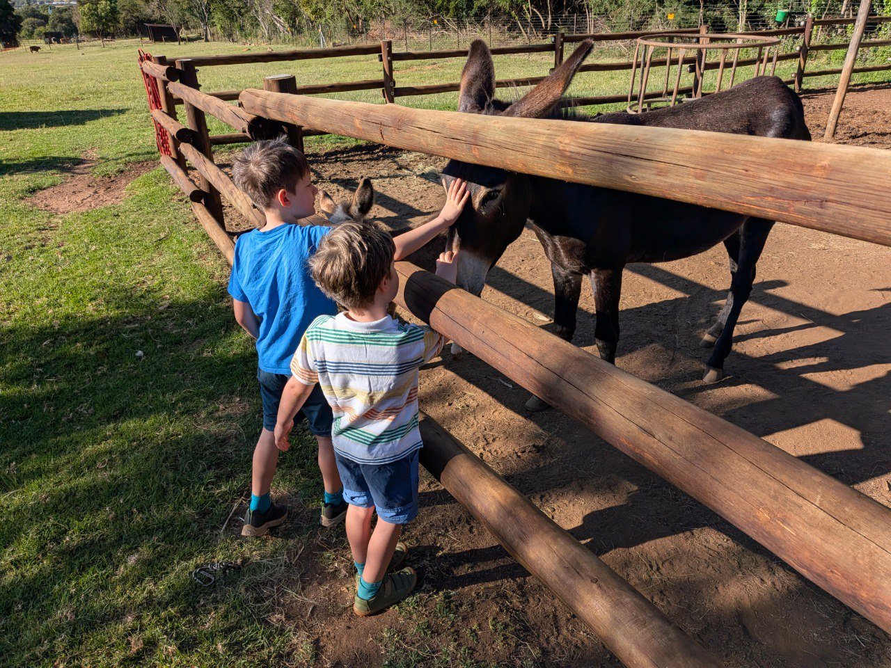
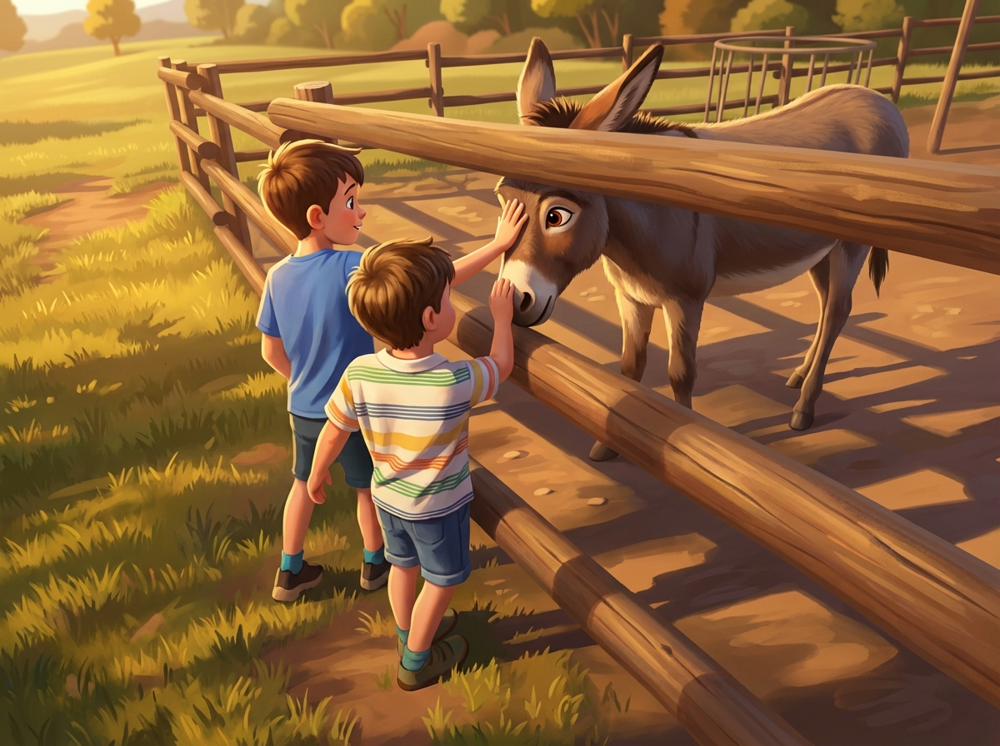

# Diario di Viaggio - 11 Febbraio 2026

## 🏛️ Ritorno alle Origini: Cradle of Humankind

La giornata di oggi è dedicata a un viaggio nel tempo, alla scoperta delle origini dell'umanità.

### Capitolo 1: Risveglio tra gli Asini

La mattinata di lunedì inizia nello stesso luogo incantato dove la famiglia ha passato la notte. Dopo il risveglio, la prima attività della giornata è tornare a salutare i veri padroni di casa: gli asini. I bambini si divertono a dare loro il latte d'asina e a fargli le ultime coccole prima della partenza.

**Ore 10:00:** Visita al **Cradle of Humankind**.

**A seguire:** Esplorazione delle **Sterkfontein Caves**.
