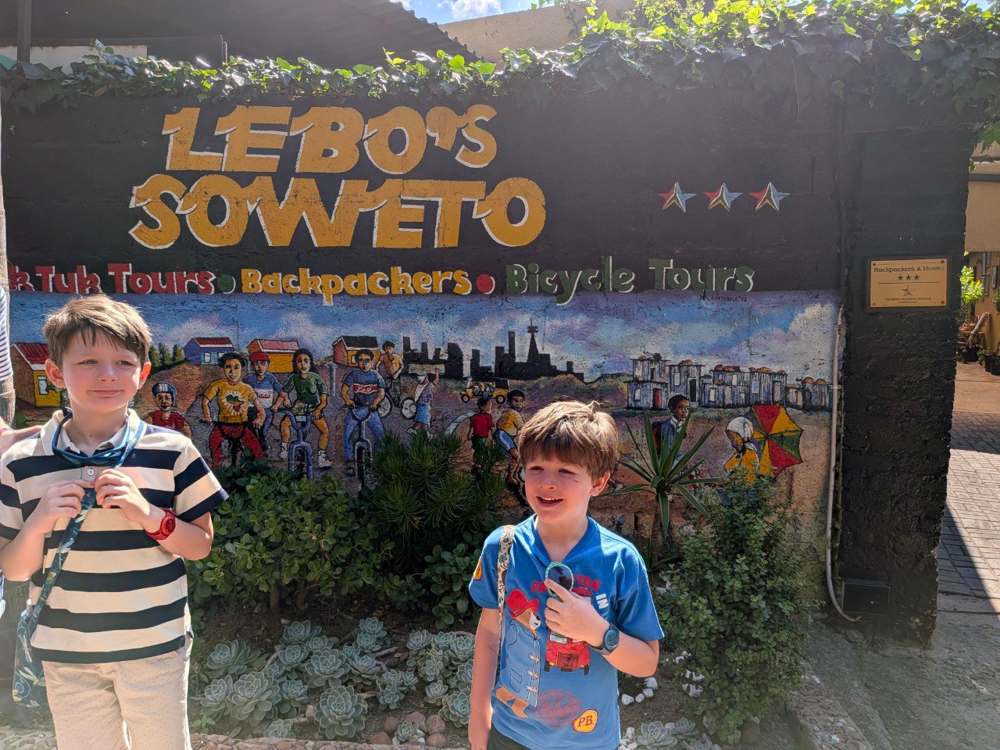
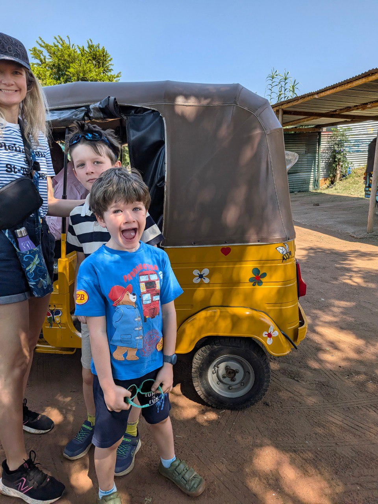

# 12 Febbraio 2026: Avventura a Soweto

[📸 Visualizza foto originali su Google Photos](https://photos.google.com/search/2026-02-12)

La giornata di oggi è dedicata alla scoperta di Soweto. Si inizia con una colazione vicino all'albergo, per poi prendere un taxi verso la township e iniziare un tour in tuk-tuk organizzato da Kate, con base di partenza da **Lebo's Soweto**.

L'entusiasmo per l'inizio del tour è palpabile, soprattutto quello di Sebi, incontenibile davanti al coloratissimo tuk-tuk giallo che li accompagnerà per le strade di Soweto.

