# 21 Febbraio 2026: Colori, Panorami e una Serata a Camps Bay

[📸 Visualizza foto originali su Google Photos](https://photos.google.com/search/2026-02-21)

### Capitolo 1: Colazione in Famiglia a Camps Bay

La giornata di sabato inizia con una colazione tranquilla a Camps Bay, con tutta la famiglia riunita.

*(Attendo foto e dettagli...)*

### Capitolo 2: Bo-Kaap, il Quartiere Arcobaleno

Dopo colazione, la giornata prosegue con una visita a Bo-Kaap, il celebre quartiere di Cape Town famoso per le sue case dai colori vivaci.

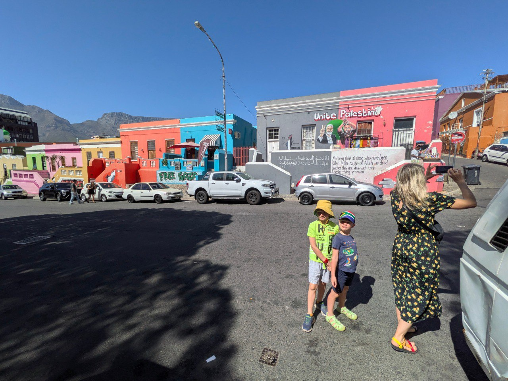

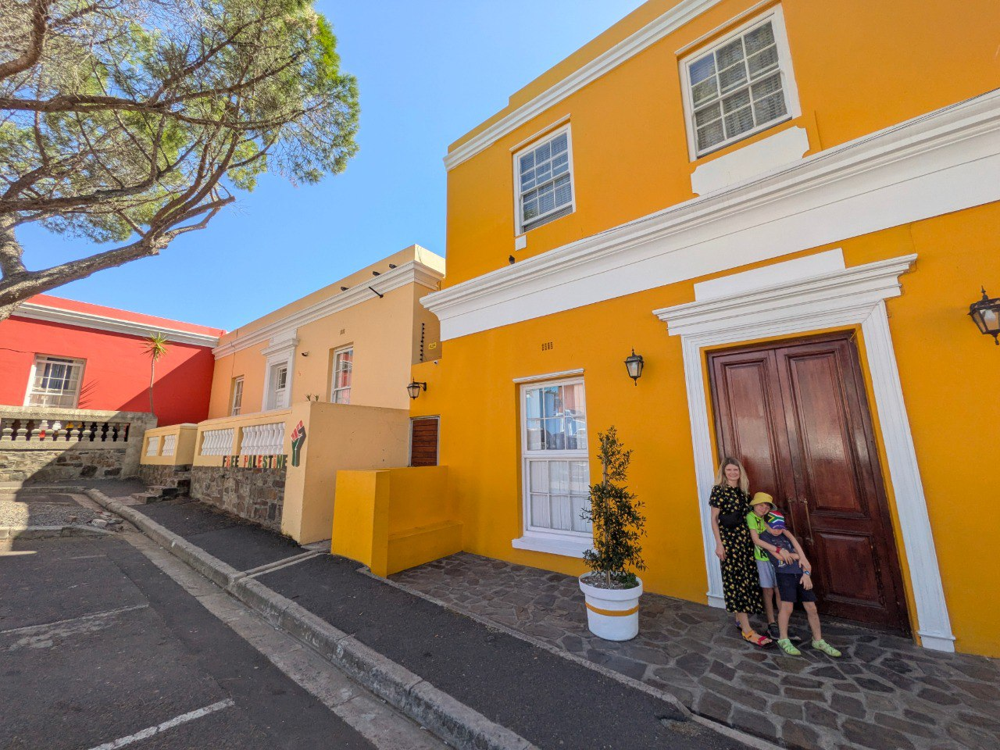
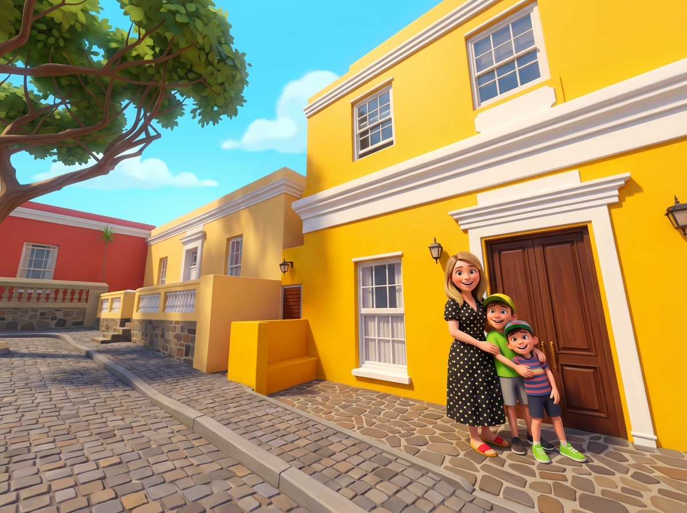
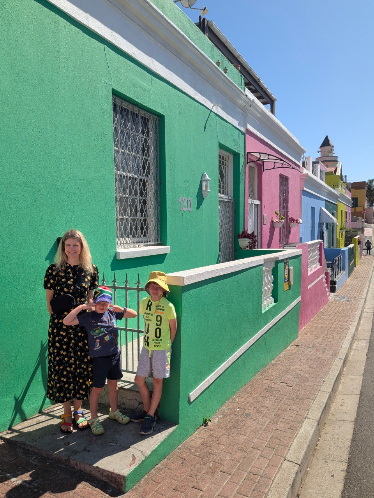
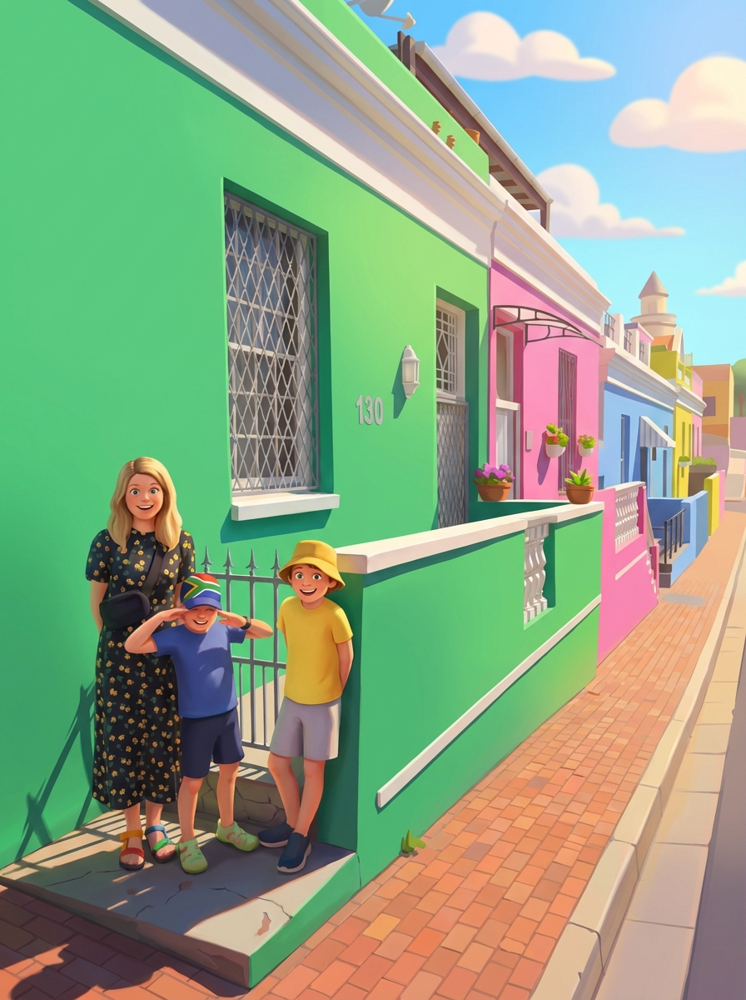

### Capitolo 3: In Cima al Belvedere

Finita la visita a Bo-Kaap, la famiglia sale in macchina per raggiungere un belvedere mozzafiato, una terrazza panoramica sulla collina di fianco a Lion's Head. Mentre in auto risuona una canzone composta da Gemini, che celebra i bambini come eroi bevitori di limonata, Riccardo riesce a "strappare" due foto a sua moglie, che soffre di vertigini ma non si tira indietro.

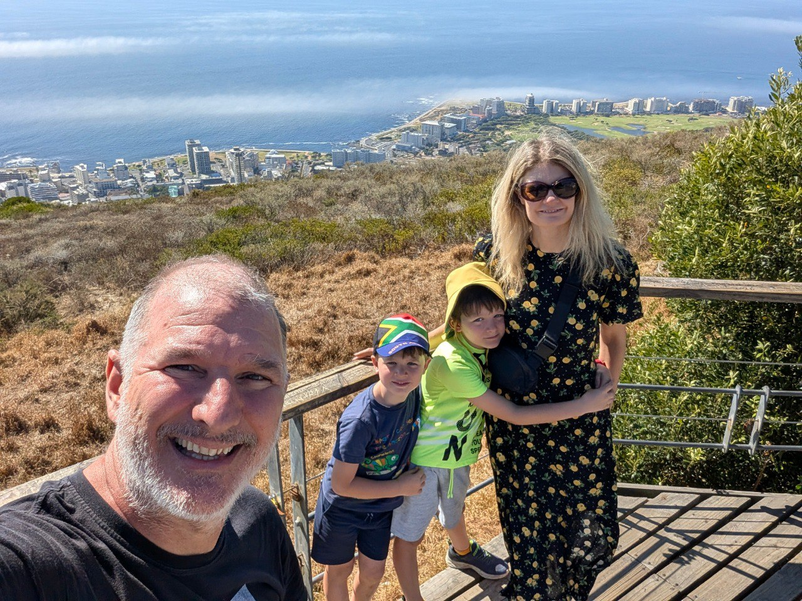
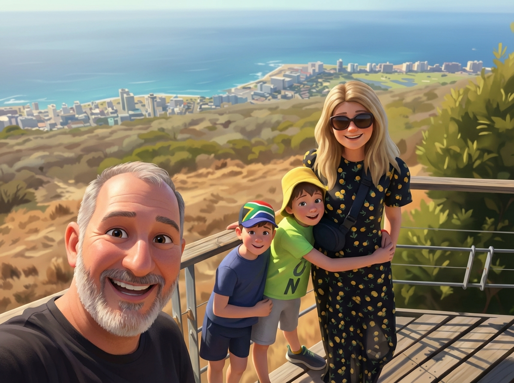
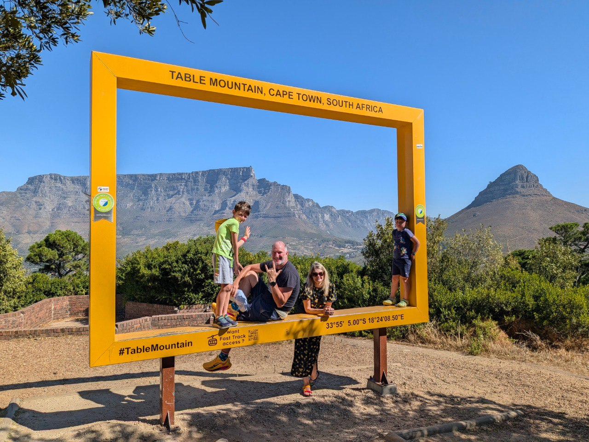
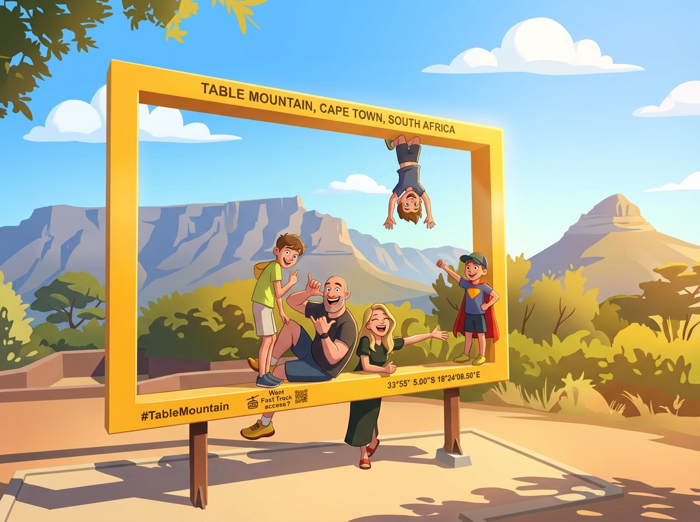

### Capitolo 4: Ritorno a Casa: Piscina e Valigie

Dopo le emozioni del centro e del belvedere, il pomeriggio prosegue con un ritorno a casa. Mentre la moglie si dedica alla preparazione delle valigie per la partenza del giorno dopo, i bambini si godono una meritata mezz'ora di relax e giochi in piscina.

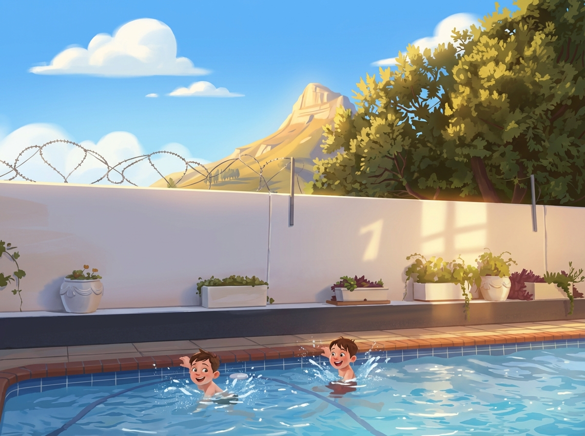

### Epilogo: L'Ultima Serata a Camps Bay

La giornata si conclude con un tocco di nostalgia. Per l'ultima serata a Camps Bay, la famiglia scende a piedi verso il lungomare, godendosi il panorama del tramonto.

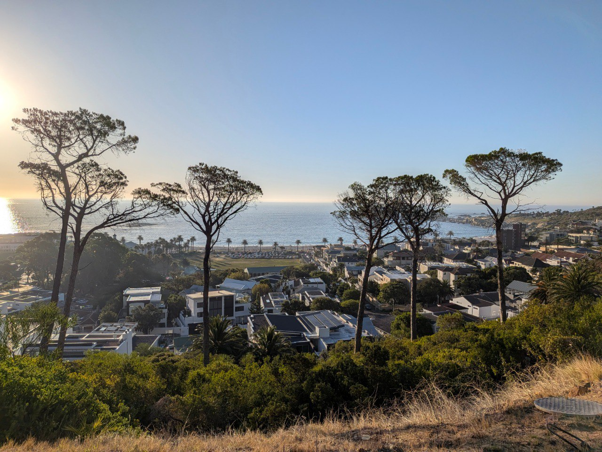

La cena è da **Codfather**, un ristorante iconico e famosissimo di Camps Bay, per un'ultima, indimenticabile scorpacciata di pesce.

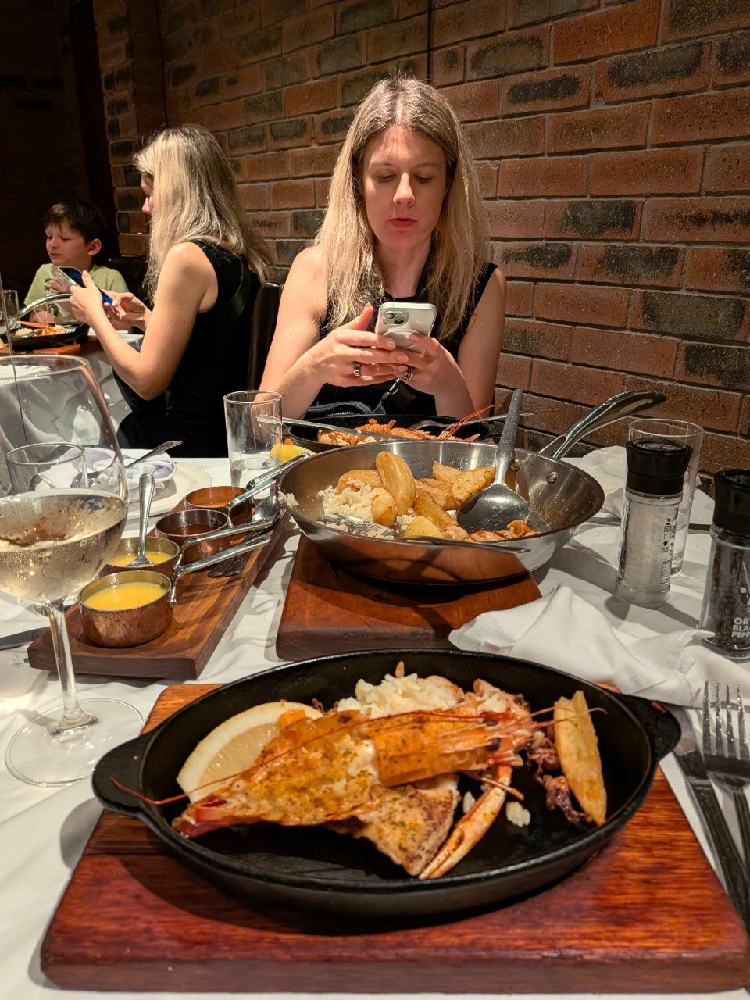
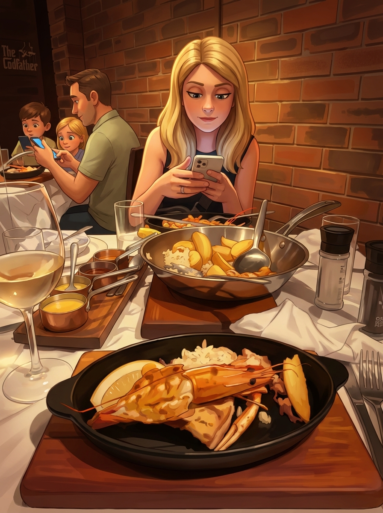
