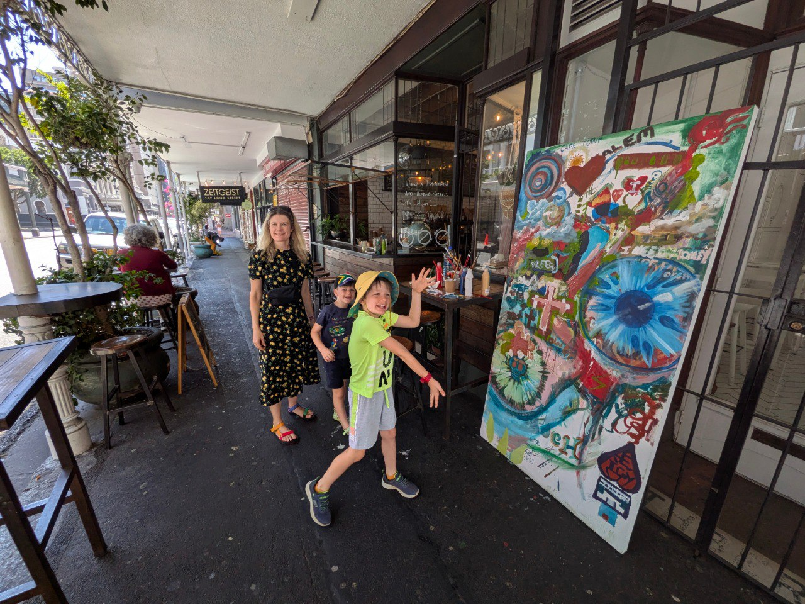
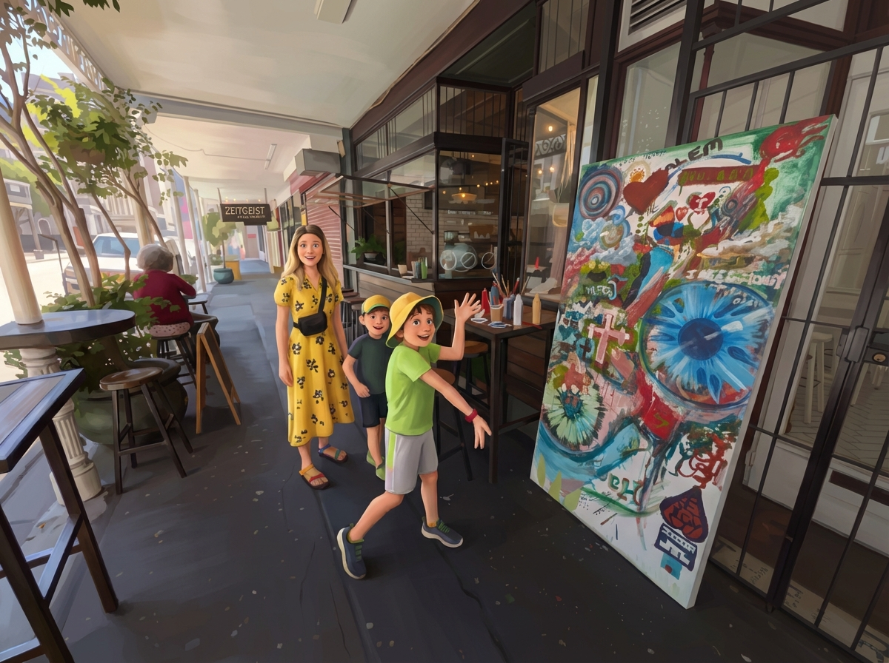
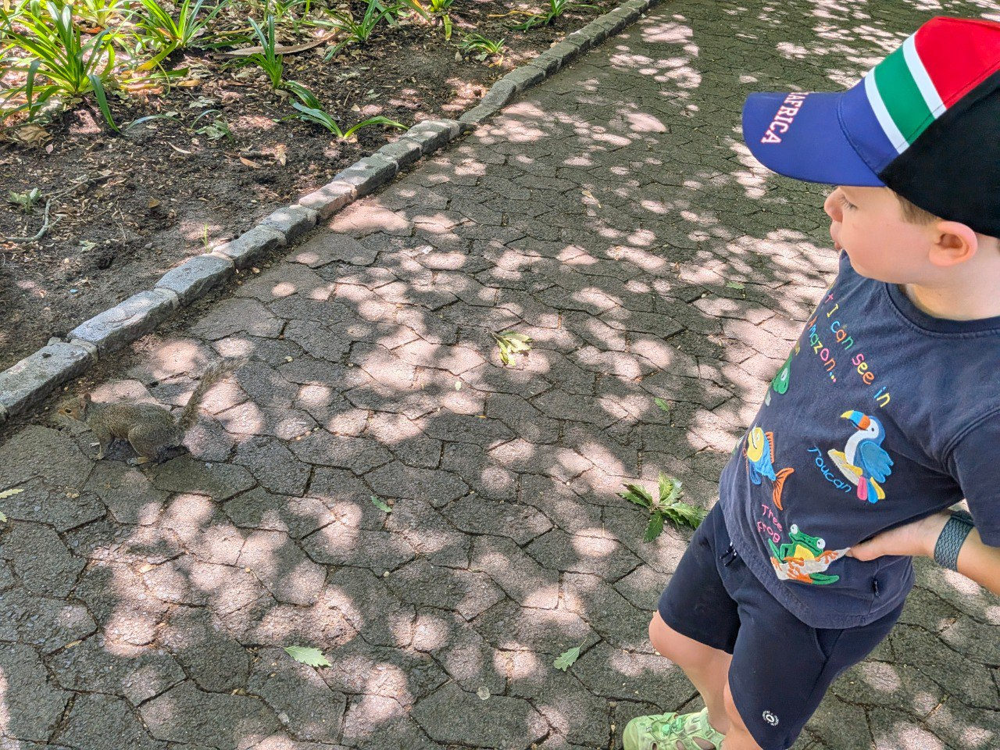
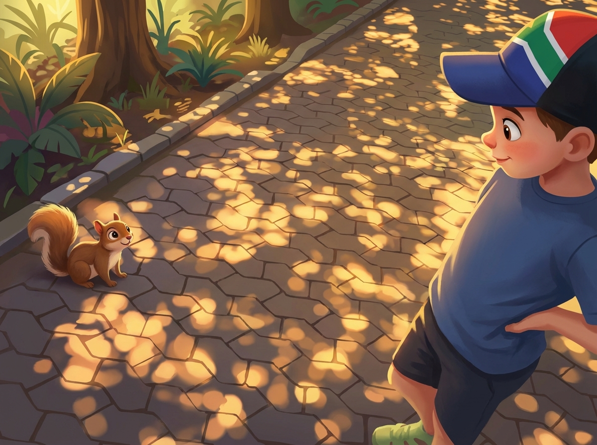
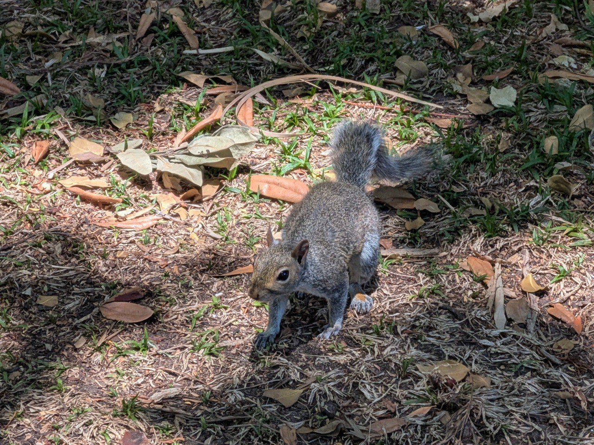
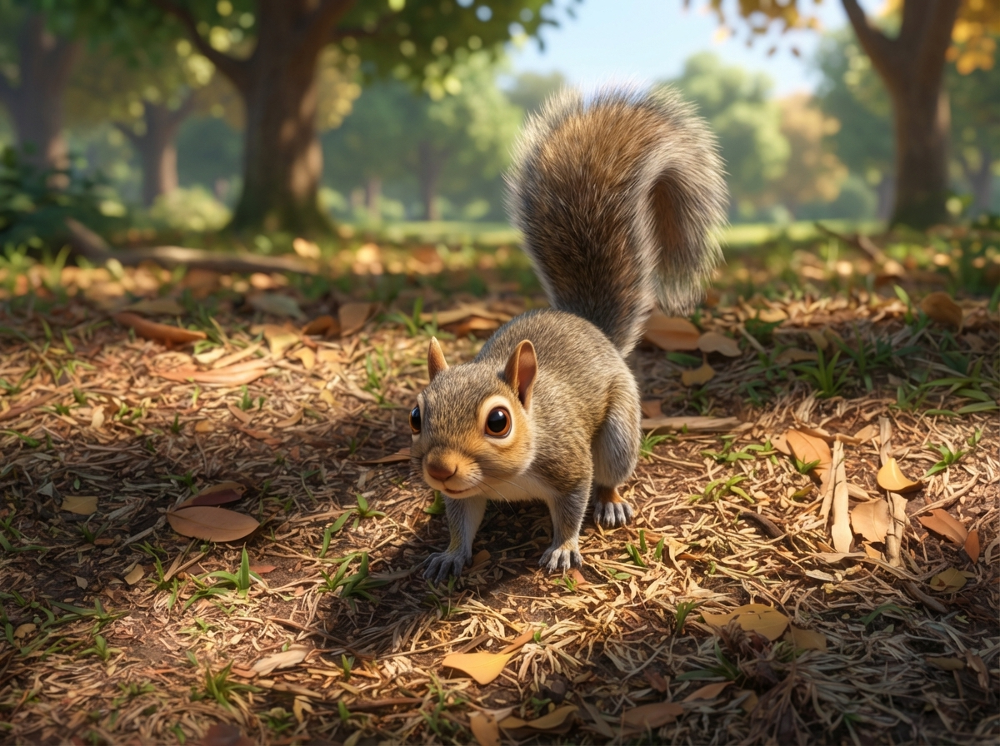
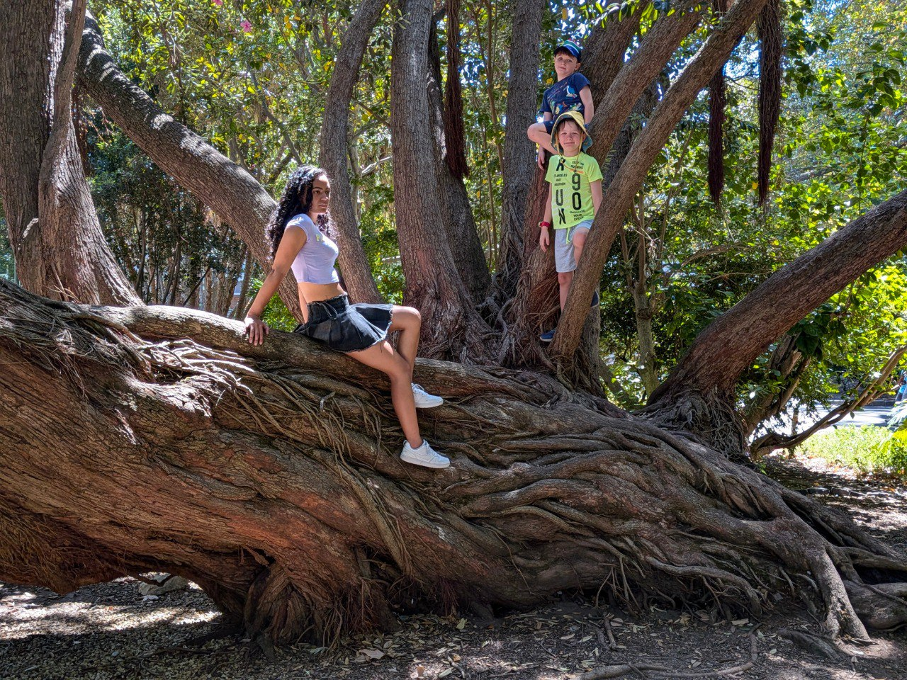
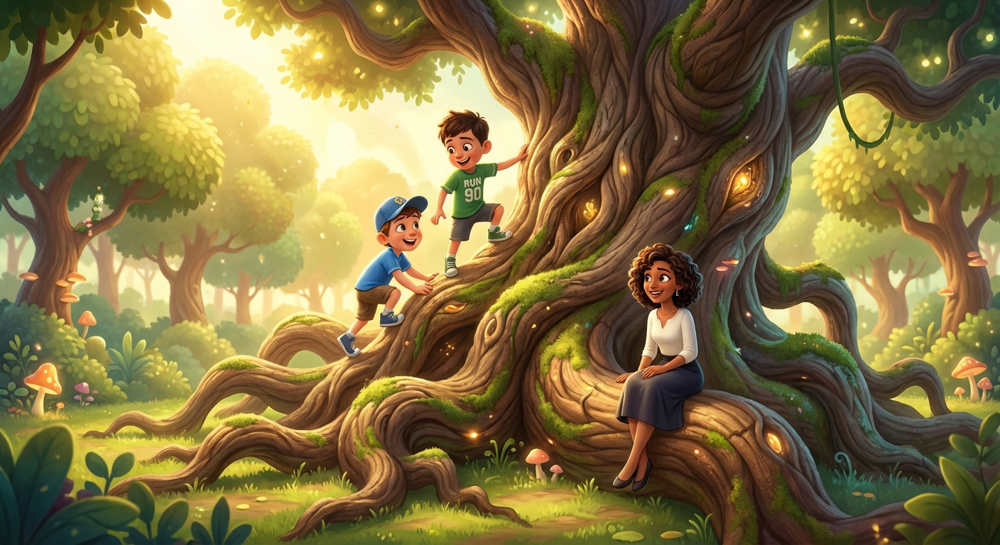
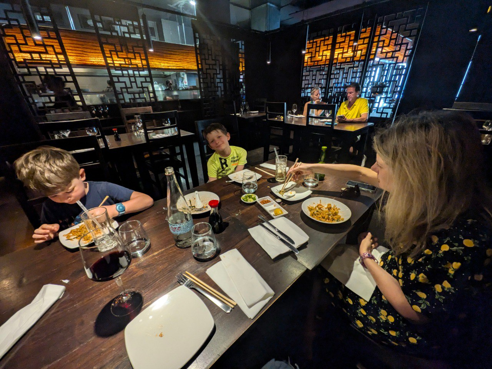
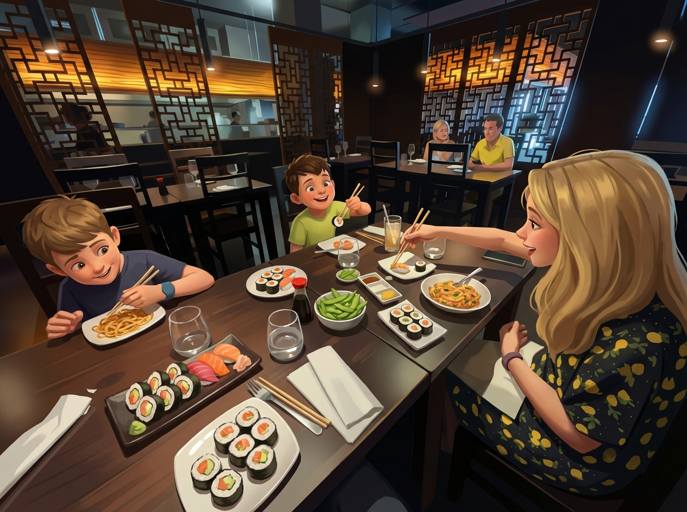

# 21 Febbraio 2026: Colori, Panorami e una Lezione di Vita

[📸 Visualizza foto originali su Google Photos](https://photos.google.com/search/2026-02-21)

### Capitolo 1: Colazione in Famiglia a Camps Bay

La giornata di sabato inizia con una colazione tranquilla a Camps Bay, con tutta la famiglia riunita.

*(Attendo foto e dettagli...)*

### Capitolo 2: Bo-Kaap, il Quartiere Arcobaleno

Dopo colazione, la giornata prosegue con una visita a Bo-Kaap, il celebre quartiere di Cape Town famoso per le sue case dai colori vivaci. Una vera e propria esplosione di tinte accese, murales politici e un'atmosfera unica.

### Capitolo 3: In Cima al Belvedere

Finita la visita a Bo-Kaap, la famiglia sale in macchina per raggiungere un belvedere mozzafiato, una terrazza panoramica sulla collina di fianco a Lion's Head. Mentre in auto risuona una canzone composta da Gemini, che celebra i bambini come eroi bevitori di limonata, Riccardo riesce a "strappare" due foto a sua moglie, che soffre di vertigini ma non si tira indietro.

Il punto panoramico è anche dotato di una iconica cornice gialla, un invito a "inquadrare" la Table Mountain e Lion's Head in una foto ricordo perfetta.

### Capitolo 4: Meritata Piscina

Dopo le emozioni del centro e del belvedere, il pomeriggio prosegue con un tuffo rinfrescante nella piscina di casa, con la vista di Lion's Head che fa da sfondo anche al relax.

### Capitolo 5: Dagli Squali agli Scoiattoli

Più tardi, la giornata riprende con una passeggiata verso il Museo di Storia Naturale, un paradiso per i bambini (e non solo) con le sue esposizioni di squali, balene e ogni sorta di animale.

L'uscita dal museo porta la famiglia nei giardini circostanti, un'oasi di pace dove l'attrazione principale diventano i numerosi scoiattoli che si avvicinano senza paura, per la gioia dei più piccoli.

### Capitolo 6: Il Pranzo della Discordia (e della Generosità)

La giornata prende una piega inaspettata al momento del pranzo. La destinazione è un ristorante meraviglioso, un posto speciale dove Riccardo era già stato sei anni prima e che non vedeva l'ora di condividere con la sua famiglia.

Ma i piani e i ricordi a volte si scontrano con la realtà. I bambini, poco affamati, e un litigio su cosa ordinare, trasformano un pranzo tanto atteso in un'esperienza frustrante. La magia del 2019 lascia il posto alla delusione del 2026. Il riso e pollo, ordinato per i bambini e non mangiato, viene impacchettato per essere portato via.

Ma qui la storia cambia di nuovo. Fuori dal ristorante, una famiglia di senzatetto chiede aiuto. In un gesto di spontanea generosità, Kate decide di regalare loro il pollo e riso appena impacchettato. Vedere la gioia e la gratitudine di quelle persone, che mangiano con gusto un pasto che per loro è un lusso, trasforma un momento di frustrazione in una lezione toccante per tutti.

### Epilogo: La Cena Sushi Conquistata

Il lieto fine è servito a tavola. Grazie al gesto di generosità che ha "liberato" la cena di scorta, la famiglia può finalmente godersi la tanto desiderata serata sushi. Una conclusione perfetta per una giornata di forti contrasti, che insegna come da un momento di difficoltà possa nascere un'opportunità per fare del bene.

