# 2026-02-23: Franschhoek, Day Two (Solo Adventure)

Seconda giornata a Franschhoek, questa volta in solitaria dopo che la famiglia è rientrata. Una giornata intensa, segnata da panorami mozzafiato, ottimi vini e incontri internazionali inaspettati.

La giornata inizia ufficialmente all'ingresso del **Franschhoek Wine Tram**, presso il terminal di **Groot Drakenstein**, il cuore pulsante e hub centrale di questa avventura enologica.

*Nota a margine: questa giornata non sarebbe stata possibile senza l'intervento provvidenziale di mia moglie da Zurigo, che alle 7 del mattino mi ha letteralmente resuscitato dopo giorni di silenzio cosmico. Lunga vita a lei!*

### L'Hub Centrale: Groot Drakenstein

Tutte le avventure della giornata partono e finiscono qui. Il mezzo di trasporto è un affascinante tram a due piani, che qui vediamo in una versione epica, pronto a portarci "Ritorno al Futuro" (o al prossimo vigneto).

### Itinerario del Giorno: Un Viaggio a Tappe (Treno & Bus)

La giornata segue un percorso ben preciso a bordo del Wine Tram (Navy Line), partendo dall'hub centrale. L'itinerario è diviso in due parti logistiche: le prime tre tappe servite dal **treno**, le successive raggiunte via **bus**.

```mermaid
graph TD
    HUB((Groot Drakenstein))
    style HUB fill:#f9f,stroke:#333,stroke-width:4px

    subgraph TRAM_LOOP [🚂 Lato Treno]
        B[Boschendal]
        P[Plaisir]
        VL[Vrede en Lust]
    end

    subgraph BUS_LOOP [🚌 Lato Bus]
        AB[Allée Bleue]
        C[Camberley - SKIP]
        BA[Bartinney]
        LP[Le Pommier]
        Z[Zorgvliet]
    end

    %% Percorso Treno
    HUB -->|1| B
    B -->|2| HUB
    HUB -->|3| P
    P -->|4| VL
    VL -->|5| P
    P -->|6| HUB

    %% Percorso Bus
    HUB -->|7| AB
    AB -->|8| C
    C -->|9| BA
    BA -->|10| LP
    LP -->|11| Z
    Z -->|12| HUB
```

Per chi preferisce una visione più magica, ecco la mappa "incantata" della nostra rotta:

---

### Tappa 1: Boschendal

La prima fermata della giornata è la storica tenuta di **Boschendal**. L'esperienza inizia con una degustazione di vini e formaggi all'aperto, in un'atmosfera rilassata e immersa nel verde.

---

### Tappa 2: Plaisir

La seconda tappa ci porta alla tenuta **Plaisir**, un'imponente proprietà in stile francese di quasi 1000 ettari, fondata nel 1693. Qui, il wine tasting è accompagnato da abbinamenti artigianali di nougat, serviti all'aperto con una vista magnifica.

Un selfie dalla terrazza per immortalare il panorama mozzafiato.

---

### Tappa 3: Vrede en Lust

La terza tappa è la tenuta di **Vrede en Lust**. Circondata da vigneti baciati dal sole, la tenuta si presenta con la sua architettura classica e un'atmosfera serena. Un punto fermo dell'itinerario che non delude mai.

---

### Tappa 4: Allée Bleue

La quarta tappa ci porta ad **Allée Bleue**. La vista da qui è spettacolare: un ombrellone blu incornicia vigneti verdissimi che si estendono fino alle montagne all'orizzonte. 

Un'altra prospettiva mozzafiato sui filari infiniti di Allée Bleue, con le montagne del Drakenstein che dominano l'orizzonte.

---

### In viaggio verso l'Alta Montagna: Il "Lato Bus"

Dopo Allée Bleue, il bus si inerpica verso le zone più alte della valle. Transitiamo davanti a **Camberley**, ma per questa volta tiriamo dritto. La vista sulle montagne da qui è maestosa, una vera atmosfera di alta quota.

---

### Tappa 5: Bartinney

L'arrivo a **Bartinney** segna il punto più alto e panoramico della giornata. La tenuta offre una vista che lascia letteralmente senza fiato sulla valle e il lago sottostante. Non a caso, è stata la sosta più apprezzata del tour.

Qui la degustazione si fa "Executive" con una selezione di rossi di alto livello.

---

### Incontri Speciali: Networking tra i Vigneti

Questa giornata è stata incredibile non solo per il vino, ma per le persone incontrate sul bus. 

Ho ritrovato con enorme piacere **Michael** e **Lucy**, gli amici conosciuti durante la prima visita del 13 febbraio. Un incontro inaspettato che ha reso il viaggio molto più allegro.

Ma le sorprese non sono finite qui: ho conosciuto anche **Martin** e **Martina**, una coppia della Repubblica Ceca. Martin lavora per KLM/Air France ed è un utente di Google Cloud (GCP)! Abbiamo passato il tempo parlando di tecnologia, di OpenClaw e di come le AI stiano cambiando il mondo.

---

### Tappa 6: Le Pommier e Zorgvliet

Le ultime fermate prima del rientro ci portano a toccare con mano il fascino storico della zona. 

Il bus fa una breve sosta a **Le Pommier**, con il suo ingresso rustico incorniciato dalle montagne.

Infine, chiudiamo il tour a **Zorgvliet**, davanti allo storico edificio "De Herenhuis" (1692). Un selfie veloce per celebrare l'ultima tappa di questa Navy Line prima che la pioggia ci costringa al rientro.

---

### Epilogo: Rientro sotto la Pioggia

Alla fine la giornata si chiude sotto una leggera pioggia. Stanco ma soddisfatto, decido di non aspettare l'ultimo bus e chiamo un Uber per tornare a casa. 

Alle 16:58 sono rientrato nel mio appartamento a Franschhoek. Sette tappe (visitate o sfiorate), incontri memorabili e una giornata che rimarrà impressa nel diario. Ora, spazio a un meritatissimo pisolino.

---
*Fine del Day Two - Franschhoek.*
