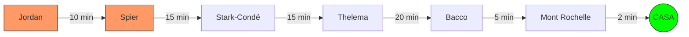

# 2026-02-24: Franschhoek, Day Three (The Grand Finale)

[📸 Visualizza foto originali su Google Photos](https://photos.google.com/search/2026-02-24)

Ultimo giorno in Sudafrica. Dopo una colazione proteica a base di 6 uova e mango, la strategia per oggi è scalare le priorità partendo dal punto più lontano.

## Obiettivi della Giornata: "The Majestic Return" (v2.0)

Abbiamo classificato le tappe con criteri da ticketing system (P1-P4) per ottimizzare il tempo rimasto prima del rientro. La rotta segue una linea retta da Ovest verso Est per minimizzare la guida a fine giornata.

| Priorità | Tappa | Perché è speciale? |
| :--- | :--- | :--- |
| **P1** | **Jordan Wine Estate** | Lo start lontano. Lago incantato e vista maestosa. Un "WOW" assicurato. |
| **P1** | **Spier Wine Farm** | L'immensità. Arte contemporanea, fiumi e spazi enormi da esplorare. |
| **P2** | **Stark-Condé** | L'impatto visivo della pagoda in mezzo al laghetto montano. |
| **P2** | **Thelema Vineyards** | La qualità del vino e la vista dominante dal passo di Helshoogte. |
| **P3** | **Anthonij Rupert** | L'eleganza italiana e il museo dei motori (per chi ha ancora occhi). |
| **P3** | **Bacco** | Il tocco italiano finale, moderno e vicino a casa. |
| **P4** | **Mont Rochelle** | L'opzione "Last Minute". La vista dall'alto su Franschhoek prima di chiudere. |

---

--- 
*(Il diario prosegue nei file modulari _01 e _02 per questa sessione)*
