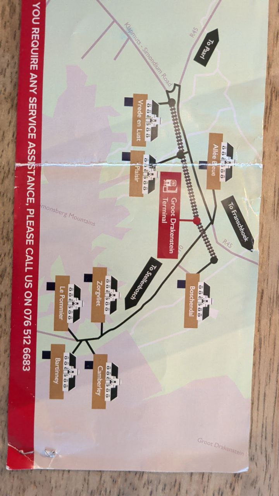
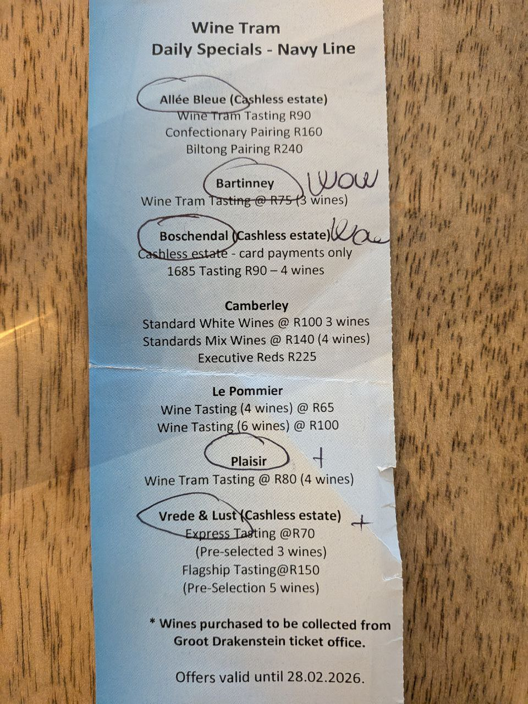

# 2026-02-24: Franschhoek, Day Three (The Last Stand)

[📸 Visualizza foto originali su Google Photos](https://photos.google.com/search/2026-02-24)

Ultimo giorno in Sudafrica. La giornata inizia con una missione culinaria: svuotare il frigorifero prima della partenza.

### Colazione da Campioni
Sveglia alle 08:30. Il menu del mattino prevede:
- 6 uova (un massacro proteico necessario).
- Un intero mango.
- Preparazione di una scorta di uva per il resto della giornata.

L'obiettivo di oggi è mappare le vigne visitate e pianificare un gran finale con le perle rimaste.

---
### Analisi delle Forze in Campo
 
### Il Grande Obiettivo di Oggi

Sulla base della mappa logistica completa, il piano per l'ultimo giorno è puntare all'eccellenza: visitare le tenute che dominano la valle dall'alto e chiudere i conti in sospeso.

- **Target 1:** Delaire Graff (L'apice della valle).
- **Target 2:** Tokara (Olio d'oliva e design).
- **Target 3:** Le Pommier (Recupero finale).

Dall'analisi dell'ultimo "bollettino di guerra" (il biglietto della Navy Line con le note a mano), emerge un quadro chiaro:

- **Elite:** *Bartinney* (segnata con un "WOW" cubitale) e *Allée Bleue*.
- **Conquistate:** *Boschendal*, *Plaisir*, *Vrede & Lust*.
- **Obiettivi Mancati:** *Camberley* e *Le Pommier*.

