# 2026-02-24: Franschhoek, Day Three (The Grand Finale)

[📸 Visualizza foto originali su Google Photos](https://photos.google.com/search/2026-02-24)

Ultimo giorno in Sudafrica. Dopo una colazione proteica a base di 6 uova e mango, la strategia per oggi è scalare le priorità partendo dal punto più lontano.

## Obiettivi della Giornata: "The Majestic Return" (v2.0)

Abbiamo classificato le tappe con criteri da ticketing system (P1-P4) per ottimizzare il tempo rimasto prima del rientro. La rotta segue una linea retta da Ovest verso Est per minimizzare la guida a fine giornata.

```mermaid
graph LR
    J[Jordan] -- "10 min" --> S[Spier]
    S -- "15 min" --> SC[Stark-Condé]
    SC -- "15 min" --> T[Thelema]
    T -- "20 min" --> B[Bacco]
    B -- "5 min" --> MR[Mont Rochelle]
    MR -- "2 min" --> HOME((CASA))

    style J fill:#f96,stroke:#333
    style S fill:#f96,stroke:#333
    style HOME fill:#0f0,stroke:#333
```

| Priorità | Tappa | Perché è speciale? |
| :--- | :--- | :--- |
| **P1** | **Jordan Wine Estate** | Lo start lontano. Lago incantato e vista maestosa. Un "WOW" assicurato. |
| **P1** | **Spier Wine Farm** | L'immensità. Arte contemporanea, fiumi e spazi enormi da esplorare. |
| **P2** | **Stark-Condé** | L'impatto visivo della pagoda in mezzo al laghetto montano. |
| **P2** | **Thelema Vineyards** | La qualità del vino e la vista dominante dal passo di Helshoogte. |
| **P3** | **Anthonij Rupert** | L'eleganza italiana e il museo dei motori (per chi ha ancora occhi). |
| **P3** | **Bacco** | Il tocco italiano finale, moderno e vicino a casa. |
| **P4** | **Mont Rochelle** | L'opzione "Last Minute". La vista dall'alto su Franschhoek prima di chiudere. |

---

### Diario di Bordo

**Ore 09:17:** In viaggio verso **Jordan Wine Estate**. Il navigatore segna 40 km di distanza e un tempo di percorrenza di circa 47 minuti. L'arrivo a destinazione (lo "Start" ufficiale della giornata) è previsto per le 11:03.

La strada è aperta, il morale è alto e le "grandi idee" per il futuro iniziano a prendere forma.

*(In attesa dell'arrivo allo Start...)*
**Ore 10:13:** Sono arrivato! Mi godo un momento di relax con un cappuccino prima di iniziare le degustazioni vere e proprie. L'atmosfera è perfetta per cominciare la giornata.
 
La terrazza esterna si affaccia direttamente su un lago calmo, creando un contrasto perfetto tra il legno scuro dei tavoli e il verde brillante dei prati. È qui che mi godo la vista sorseggiando il mio cappuccino.

