# 2026-02-24: Franschhoek, Day Three (The Grand Finale)

[📸 Visualizza foto originali su Google Photos](https://photos.google.com/search/2026-02-24)

Ultimo giorno in Sudafrica. Dopo una colazione proteica a base di 6 uova e mango, la strategia per oggi è scalare le priorità partendo dal punto più lontano.

## Obiettivi della Giornata: "The Majestic Return" (v2.0)

Abbiamo classificato le tappe con criteri da ticketing system (P1-P4) per ottimizzare il tempo rimasto prima del rientro. La rotta segue una linea retta da Ovest verso Est per minimizzare la guida a fine giornata.

```mermaid
graph LR
    J[Jordan] -- "10 min" --> S[Spier]
    S -- "15 min" --> SC[Stark-Condé]
    SC -- "15 min" --> T[Thelema]
    T -- "20 min" --> B[Bacco]
    B -- "5 min" --> MR[Mont Rochelle]
    MR -- "2 min" --> HOME((CASA))

    style J fill:#f96,stroke:#333
    style S fill:#f96,stroke:#333
    style HOME fill:#0f0,stroke:#333
```

| Priorità | Tappa | Perché è speciale? |
| :--- | :--- | :--- |
| **P1** | **Jordan Wine Estate** | Lo start lontano. Lago incantato e vista maestosa. Un "WOW" assicurato. |
| **P1** | **Spier Wine Farm** | L'immensità. Arte contemporanea, fiumi e spazi enormi da esplorare. |
| **P2** | **Stark-Condé** | L'impatto visivo della pagoda in mezzo al laghetto montano. |
| **P2** | **Thelema Vineyards** | La qualità del vino e la vista dominante dal passo di Helshoogte. |
| **P3** | **Anthonij Rupert** | L'eleganza italiana e il museo dei motori (per chi ha ancora occhi). |
| **P3** | **Bacco** | Il tocco italiano finale, moderno e vicino a casa. |
| **P4** | **Mont Rochelle** | L'opzione "Last Minute". La vista dall'alto su Franschhoek prima di chiudere. |

---

### Diario di Bordo

**Ore 09:17:** In viaggio verso **Jordan Wine Estate**. Il navigatore segna 40 km di distanza e un tempo di percorrenza di circa 47 minuti. L'arrivo a destinazione (lo "Start" ufficiale della giornata) è previsto per le 11:03.

La strada è aperta, il morale è alto e le "grandi idee" per il futuro iniziano a prendere forma.

*(In attesa dell'arrivo allo Start...)*
**Ore 10:13:** Sono arrivato! Mi godo un momento di relax con un cappuccino prima di iniziare le degustazioni vere e proprie. L'atmosfera è perfetta per cominciare la giornata.
 
### Una "Funny Story" Off-Road

Tentando di raggiungere la tenuta di De Toren, mi ritrovo in una strada sterrata al limite del praticabile. Finisco letteralmente impantanato tra i vigneti, circondato da un panorama mozzafiato ma con la macchina che non ne vuole sapere di avanzare. Tra nuvole scenografiche e laghetti in lontananza, decido per un saggio dietrofront strategico.

 
Poco più avanti, mi fermo ad ammirare come gli olivi e i vigneti si intrecciano armoniosamente contro le colline. Un dettaglio della natura che riconcilia con il lungo viaggio per arrivare fin qui.
 
### Tappa Extra: DeMorgenzon

A soli 500 metri da Jordan, facendo manovra, incappo in una vera perla: **DeMorgenzon**. La vista dei vigneti affiancati agli oliveti è pura magia per un occhio italiano. Una sosta imprevista che si rivela una delle scoperte più belle della mattinata.

 
Ma ecco che la fortuna gira: sta spuntando il sole! La luce filtra tra le foglie degli alberi e illumina la fontana in mezzo al lago. L'atmosfera cambia istantaneamente, diventando radiosa e calda.
 
### Una "Funny Story" Off-Road

Tentando di raggiungere la tenuta di De Toren, mi ritrovo in una strada sterrata al limite del praticabile. Finisco letteralmente impantanato tra i vigneti, circondato da un panorama mozzafiato ma con la macchina che non ne vuole sapere di avanzare. Tra nuvole scenografiche e laghetti in lontananza, decido per un saggio dietrofront strategico.

 
Poco più avanti, mi fermo ad ammirare come gli olivi e i vigneti si intrecciano armoniosamente contro le colline. Un dettaglio della natura che riconcilia con il lungo viaggio per arrivare fin qui.
 
### Tappa Extra: DeMorgenzon

A soli 500 metri da Jordan, facendo manovra, incappo in una vera perla: **DeMorgenzon**. La vista dei vigneti affiancati agli oliveti è pura magia per un occhio italiano. Una sosta imprevista che si rivela una delle scoperte più belle della mattinata.

 
Nonostante la bellezza della terrazza, devo ammettere che Jordan non mi ha regalato quel "Wow" che mi aspettavo, specialmente dopo i 50 minuti di viaggio necessari per raggiungerla. Una tappa piacevole per un caffè, ma forse meno memorabile di altre.

 
La terrazza esterna si affaccia direttamente su un lago calmo, creando un contrasto perfetto tra il legno scuro dei tavoli e il verde brillante dei prati. È qui che mi godo la vista sorseggiando il mio cappuccino.

---

### Tappa 2: Spier Wine Farm

Arrivo a **Spier** alle **10:55**. L'\''impatto è notevole: la tenuta è vastissima, un vero e proprio parco dove l'\''arte e la natura si fondono. Una sosta obbligatoria per chi cerca spazi aperti e un'\''atmosfera vibrante.
 
Uno degli angoli più suggestivi è senza dubbio lo stagno ricoperto di ninfee: un vero quadro naturale che riflette il cielo drammatico e invita alla contemplazione.

