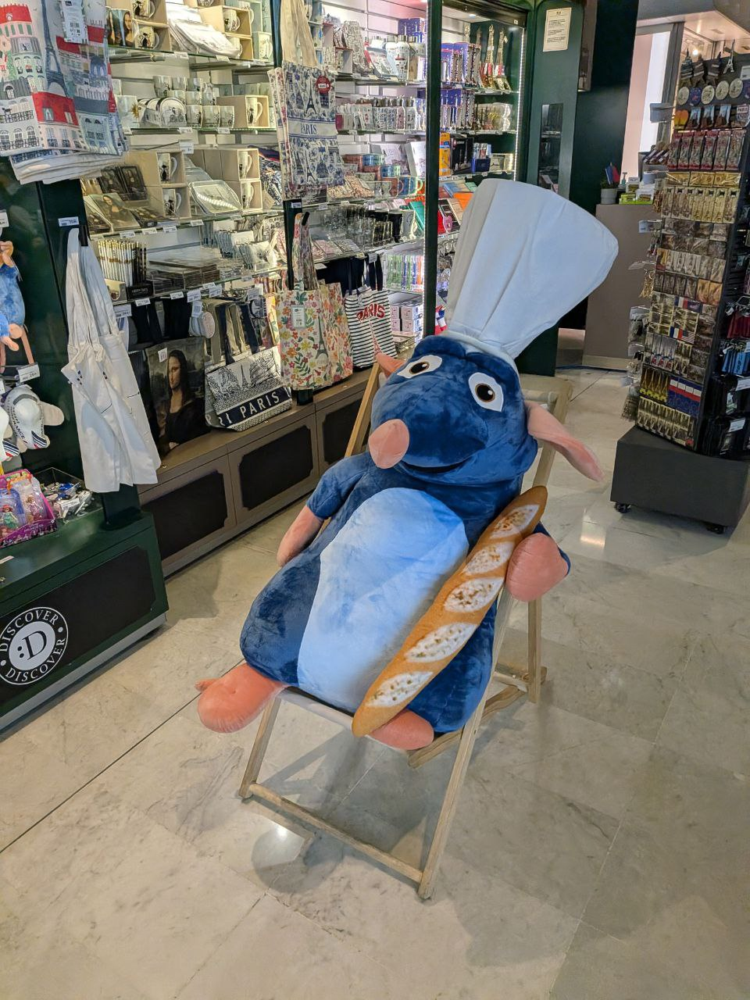
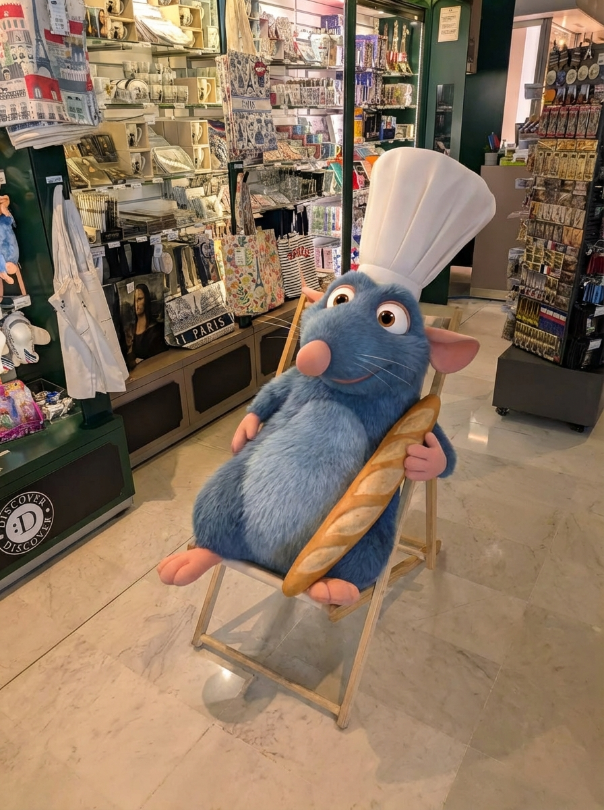
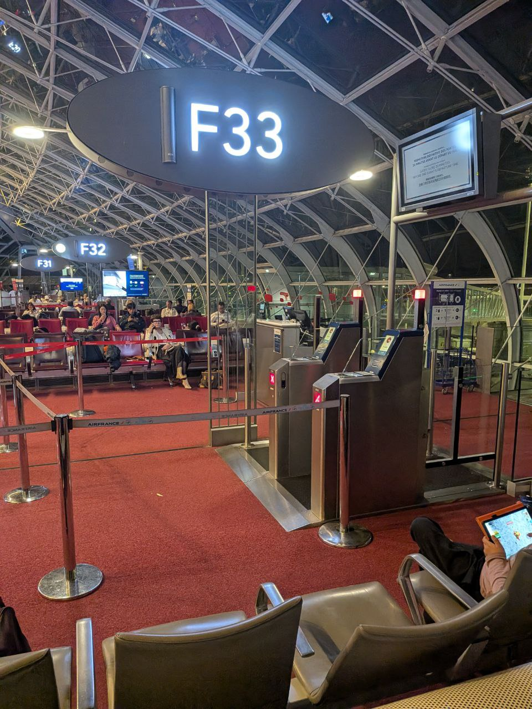
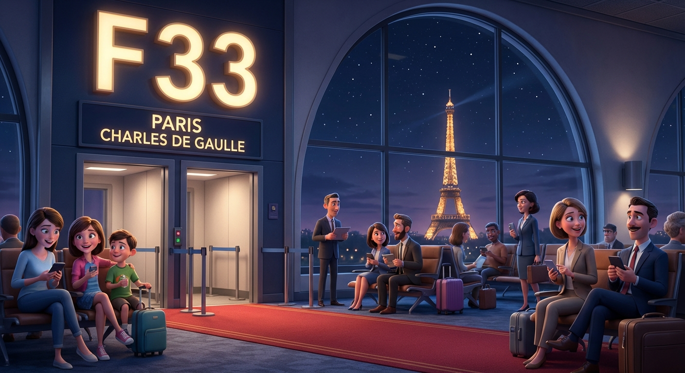

# 25 Febbraio 2026: Scalo a Parigi

Dopo un lungo volo, l'arrivo a Parigi segna l'ultima tappa del viaggio di ritorno. Durante la corsa per raggiungere la coincidenza per Zurigo, c'è tempo per un incontro ravvicinato con un'icona locale in un negozio di souvenir: Rémy di Ratatouille, in versione peluche gigante, che si gode il suo eterno riposo con una baguette in mano.

La corsa contro il tempo si conclude con successo: Gate F33, destinazione Zurigo, raggiunto. Missione compiuta.

### Epilogo: Atterraggio a Zurigo

Dopo un'odissea durata quasi un giorno intero, il viaggio si conclude. L'aereo è atterrato a Zurigo. Missione compiuta. Bentornato a casa, Riccardo.
