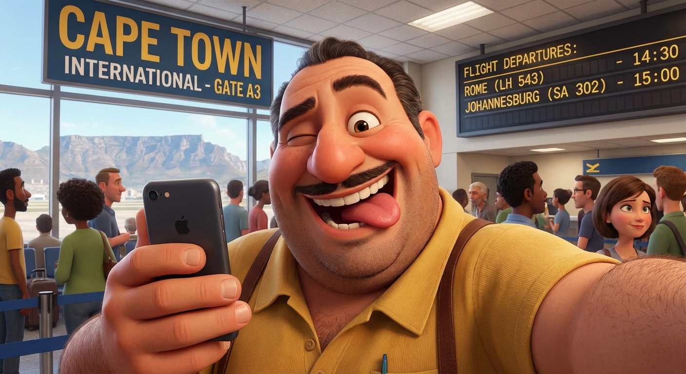

# Capitolo 6: L'Attesa al Gate A3

E finalmente, eccoci al gate. Il gate A3 per la precisione. Dopo tutte le peripezie, il momento della partenza si avvicina. L'umore è alto, la stanchezza si fa sentire, ma la felicità di tornare a casa vince su tutto.

Quale modo migliore per celebrare se non con un selfie liberatorio davanti al tabellone?

E come ormai da tradizione, ecco la versione artistica della scena.

Ora non resta che attendere l'imbarco. Parigi, stiamo arrivando.
