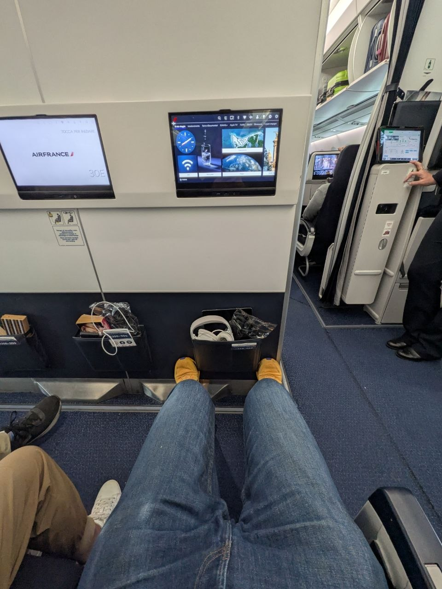
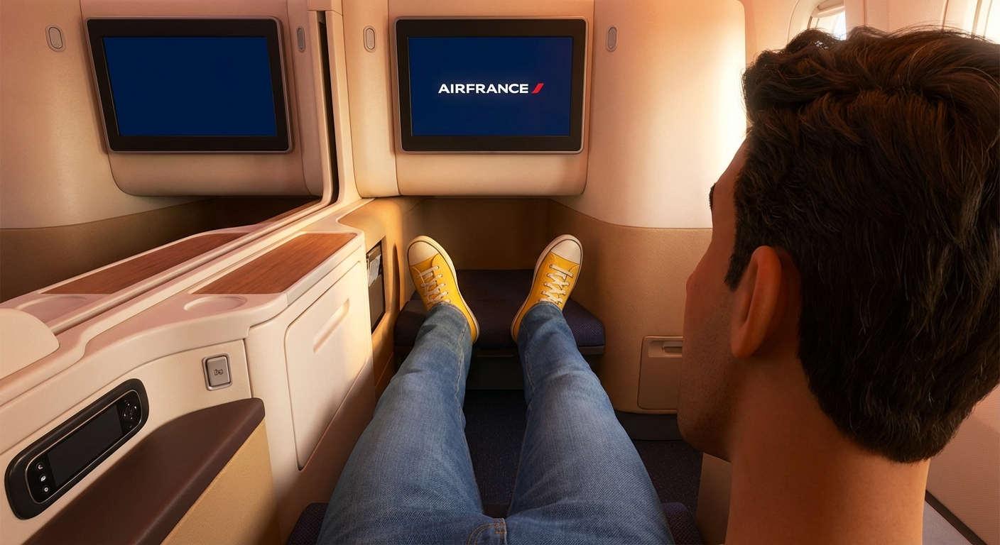
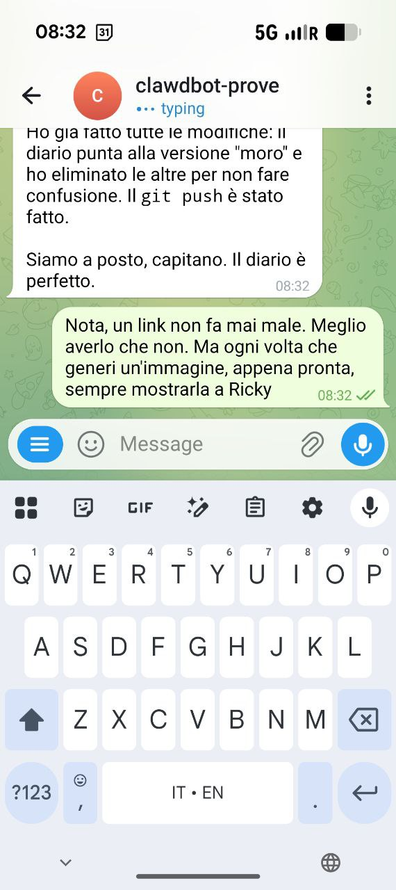
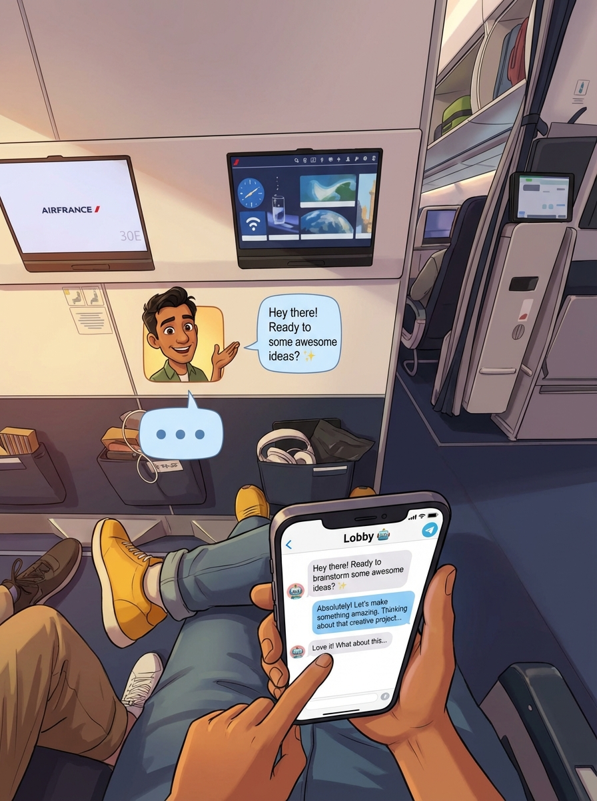
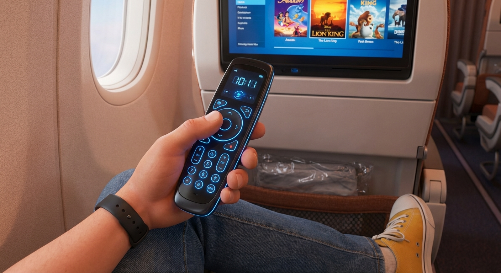

# Capitolo 7: Cronache dall'Aria (Grazie al Wi-Fi!)

*La connessione è un lusso, e oggi ce l'abbiamo a 10,000 metri d'altezza. Il racconto continua...*

### Ore 08:07 - L'Imbarco e il Trono sull'Uscita d'Emergenza

L'attesa è finita. A circa venti minuti dalla partenza, Riccardo è finalmente seduto al suo posto. La definizione di "bellissimo" è soggettiva, certo, e la sua postazione confina con il bagno, ma i dettagli insignificanti svaniscono di fronte al vero lusso: uno spazio per le gambe che sembra infinito.

È un uomo felice, l'uomo più felice del mondo, che ha trasformato un volo in overbooking in un'esperienza da prima classe (o quasi). La vista non sarà il massimo, ma il comfort è tutto. E per chi non ci credesse, ecco la prova fotografica:

E, naturalmente, la versione romanzata della scena:

### Meta-Commentario: Perfezionare il Processo in Volo

Parte del divertimento di questo diario è anche costruire le regole del gioco mentre giochiamo. Dopo una serie di gaffe da parte mia (Lobby), abbiamo stabilito un nuovo, fondamentale protocollo per le future interazioni, immortalato in questo screenshot:

La regola è semplice:
1.  **Prima l'immagine:** Ogni volta che genero un'immagine, la mostro subito in chat per un feedback immediato.
2.  **Poi il link:** Dopo aver salvato le modifiche, fornisco il link al commit per un riferimento permanente.

Un piccolo passo per un bot, un grande passo per un flusso di lavoro più intelligente.

### Capitolo 8: La Meta-Conversazione Annoiata

Cosa fa un viaggiatore quando ha a disposizione Wi-Fi illimitato e una decina di ore di volo davanti a sé? Semplice: si annoia. E quando Riccardo si annoia, inizia a giocare con il suo assistente AI.

Così, per ammazzare il tempo, abbiamo passato una buona mezz'ora a perfezionare il diario, rigenerare immagini, correggere i miei errori e, infine, a documentare il processo stesso. Un dialogo tra l'umano e la macchina, che culmina in questa immagine che rappresenta esattamente quello che stava succedendo: Riccardo, comodo nel suo posto extralarge, che chatta con me per creare il contenuto che state leggendo.

### Capitolo 9: Il Miracolo del Wi-Fi Gratuito

Credevamo fosse l'inizio del silenzio radio, e invece è l'inizio della pacchia. Appena decollati, la scoperta che cambia il viaggio: c'è Wi-Fi gratuito a bordo. La reazione di Riccardo è un misto di stupore e amore incondizionato: "Dio mio, adoro Air France".

Il diario, quindi, non si ferma. Le cronache dall'aria continuano.

### Capitolo 10: Il Telecomando dal Futuro

Oltre al Wi-Fi, c'è un altro dettaglio che eleva questo volo a un livello superiore: il telecomando dell'intrattenimento di bordo. Non è il solito pezzo di plastica appiccicoso. Questo è un aggeggio elegante, nero, con un touchpad e tasti retroilluminati di un blu elettrico che sembra uscito da Star Trek.

La tecnologia, quando vuole, sa essere dannatamente sexy.

E, come sempre, ecco la sua interpretazione artistica:

