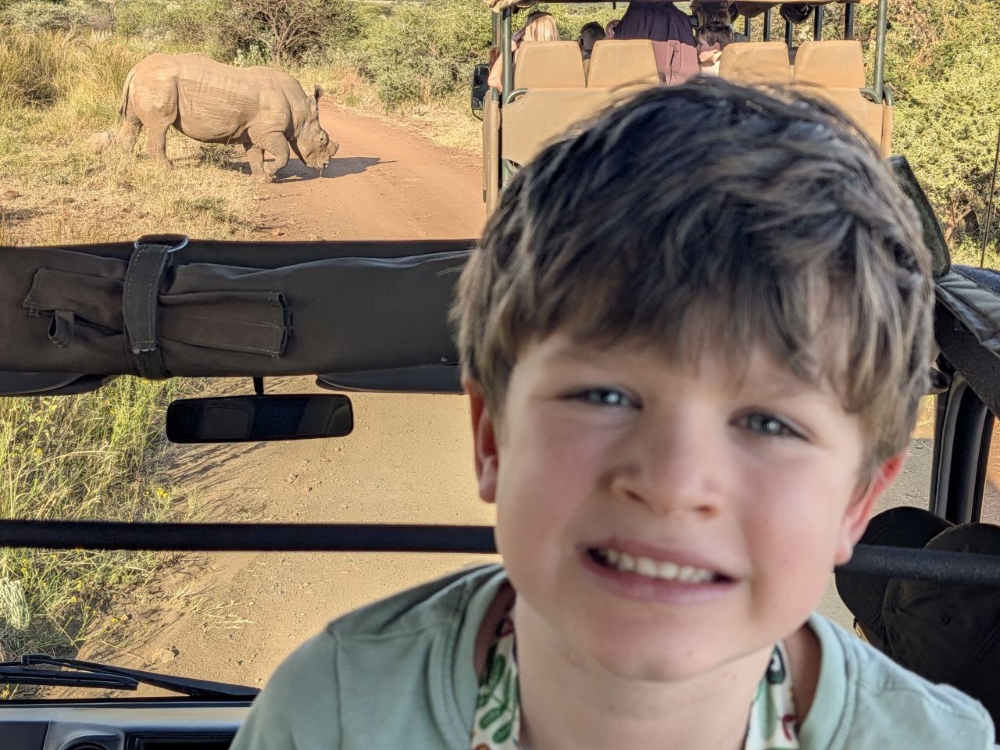
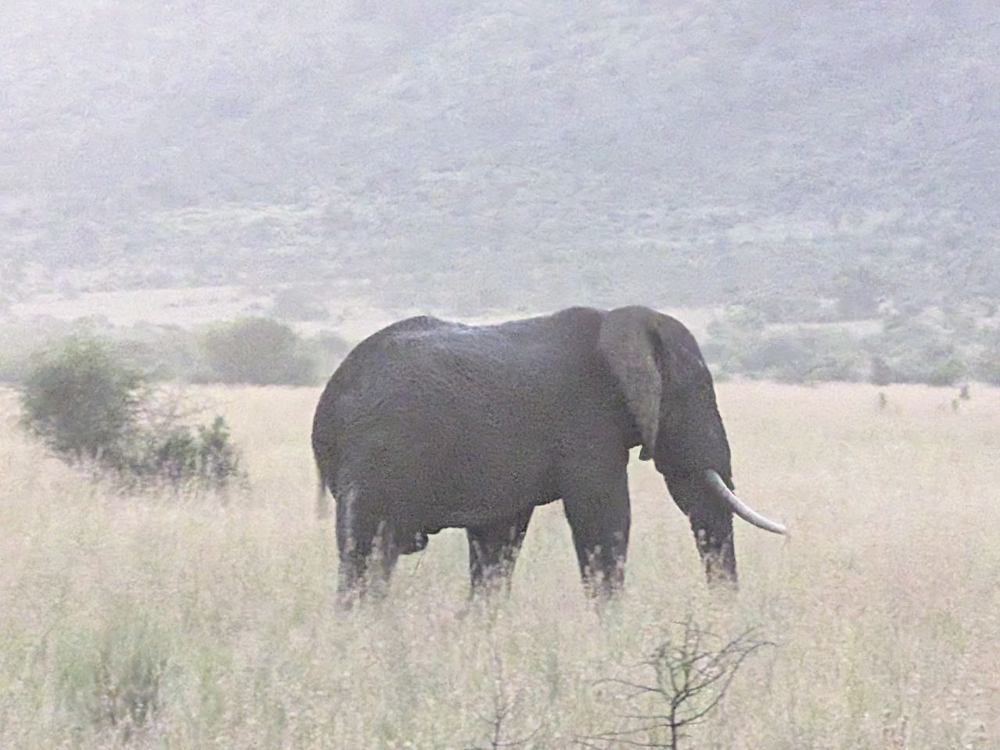
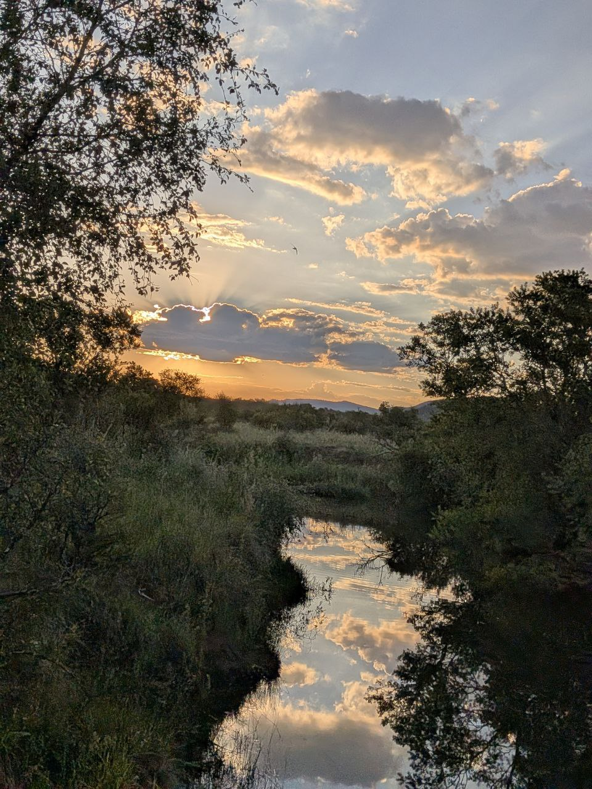

# 🇿🇦 South Africa Diary

## Friday, February 6, 2026: Arrivo a Johannesburg e primo safari

... (previous content from Feb 6 remains unchanged) ...

## Saturday, February 7, 2026: Safari a Pilanesberg, tra Tassi e Cene nel Boma

La nostra avventura a Pilanesberg continua a regalarci spettacoli incredibili!

### Avvistamenti del pomeriggio/sera (16:30 - 20:00):

Il safari di oggi è stato ricco di sorprese. Ale era in prima linea con il binocolo, pronto a non perdersi nulla.

Ecco il bottino della giornata:
- **Tsessebe** (un tipo di antilope)
- **Red Hartebeest** (un'altra antilope, la "Red hot Beast" delle note)
- 2 **Sciacalli** (Jackals)
- **Kori Bustard** (il "Cory bastard", un uccello molto grande)
- **Elefante** in lontananza
- Un magnifico **Kudu**
- 6 **Faraone** (Guinea fowl)
- Un **Gufo reale maculato** (Spotted eagle owl)
- E per finire... un **Tasso del miele** (Honey Badger), avvistato dal campione, Alessandro! 🦡
- Un **Vervet Monkey** 🐒 (avvistato da un attentissimo Seby!)
- Un branco di **Impala** composto da soli maschi ("bachelor herd")
- Un **Roybock** (probabilmente un'antilope Rhebok)
- 5 **Zebre**
- Altri 9 **Impala**

Abbiamo avuto la fortuna di vedere un elefante solitario che si muoveva nella savana.

*La versione Pixar:*

Poco dopo, un Kudu maestoso con le sue corna impressionanti.

*La versione Pixar:*

E ovviamente, le zebre non potevano mancare, questa volta con mamma e Ale a fare da cornice.

*La versione Pixar:*

Al calar della notte, abbiamo anche avvistato un gufo.

### La Boma Dinner

Dopo il safari, ci siamo immersi in una tradizione sudafricana: la **Boma dinner**. È stata un'esperienza fantastica, una cena attorno a un grande falò sotto le stelle. L'atmosfera era magica. C'è stato anche un piccolo incidente diplomatico quando Alessandro, un po' stanco, ha rovesciato un piatto, ma la serata si è conclusa alla grande tra buon cibo e risate.

Siamo rientrati a tempo di record, tutti a nanna per le 21:00. Domani la sveglia suona alle 5:00 per un'altra avventura nella savana!
