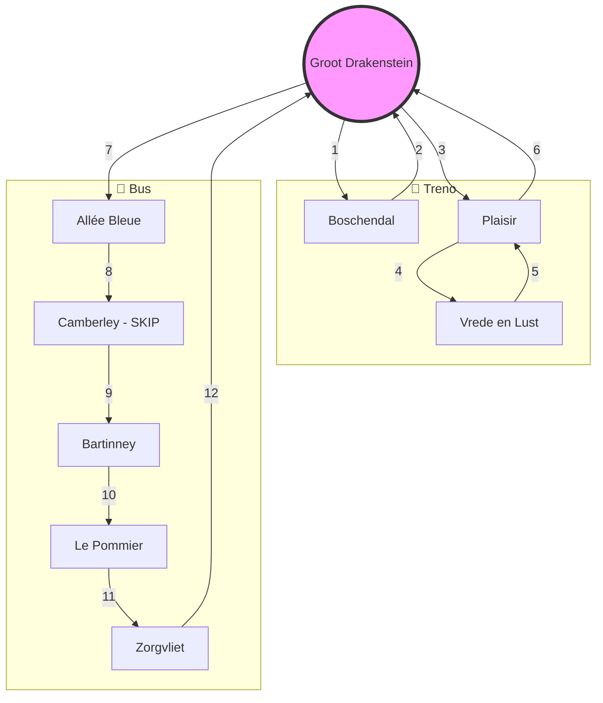

# 2026-02-23: Franschhoek, Day Two (Solo Adventure)

Seconda giornata a Franschhoek, questa volta in solitaria dopo che la famiglia è rientrata. Una giornata intensa, segnata da panorami mozzafiato, ottimi vini e incontri internazionali inaspettati.

La giornata inizia ufficialmente all'ingresso del **Franschhoek Wine Tram**, presso il terminal di **Groot Drakenstein**, il cuore pulsante e hub centrale di questa avventura enologica.



_Nota a margine: questa giornata non sarebbe stata possibile senza l'intervento provvidenziale di mia moglie da Zurigo, che alle 7 del mattino mi ha letteralmente resuscitato dopo giorni di silenzio cosmico. Lunga vita a lei!_

### L'Hub Centrale: Groot Drakenstein

Tutte le avventure della giornata partono e finiscono qui. Il mezzo di trasporto è un affascinante tram a due piani, che qui vediamo in una versione epica, pronto a portarci "Ritorno al Futuro" (o al prossimo vigneto).





### Itinerario del Giorno: Un Viaggio a Tappe (Treno & Bus)

La giornata segue un percorso ben preciso a bordo del Wine Tram (Navy Line), partendo dall'hub centrale. L'itinerario è diviso in due parti logistiche: le prime tre tappe servite dal **treno**, le successive raggiunte via **bus**.

Per chi preferisce una visione più magica, ecco la mappa "incantata" della nostra rotta:



---

### Tappa 1: Boschendal ("The Farm with a Purpose")

La prima fermata della giornata è la storica tenuta di **Boschendal**. L'esperienza inizia con una degustazione di vini e formaggi all'aperto, in un'atmosfera rilassata e immersa nel verde. Definita "The Farm with a Purpose", colpisce per la sua estensione sterminata: si possono percorrere chilometri rimanendo sempre all'interno dei suoi confini.

- Ho fatto amicizia con una coppia adorabile di Northampton, a nord di Londra.
- Subito dopo, ho conosciuto Michael della contea di Meath e la sua simpaticissima ragazza, Lucy, di Port Elizabeth. Ora vivono a Marsiglia.
- Tornando verso la fermata, ho notato una "Tree House" che sarebbe assolutamente perfetta per i bambini. Un giorno dovremo tornarci e dormire lì con Alessandro e Sebastian.
- Sul treno ho anche scambiato due chiacchiere con una ragazza tedesca di nome Assia, in viaggio da sola. È qui per due settimane di smart working seguite da tre di vacanza, una tradizione che ripete ogni anno. Non male!



---

### Tappa 2: Plaisir

La seconda tappa ci porta alla tenuta **Plaisir**, un'imponente proprietà in stile francese di quasi 1000 ettari, fondata nel 1693. Qui, il wine tasting è accompagnato da abbinamenti artigianali di nougat (due bianchi e un rosso), serviti all'aperto con una vista magnifica.



---

### Tappa 3: Vrede en Lust

La terza tappa è la tenuta di **Vrede en Lust**. Circondata da vigneti baciati dal sole, la tenuta si presenta con la sua architettura classica e un'atmosfera serena. Un punto fermo dell'itinerario che non delude mai.

- Ritrovo con piacere gli amici Lucy e Michael.
- Decido di provare un "Premium tasting" per soli 100 Rand.
- Il servizio si rivela incredibilmente lento, e alle 12:50 ho finalmente completato l'assaggio dei cinque vini.



Un selfie tra i vigneti e le magnifiche montagne della tenuta.



---

### Tappa 4: Allée Bleue

La quarta tappa ci porta ad **Allée Bleue**. La vista da qui è spettacolare: un ombrellone blu incornicia vigneti verdissimi che si estendono fino alle montagne all'orizzonte.



Un'altra prospettiva mozzafiato sui filari infiniti di Allée Bleue, con le montagne del Drakenstein che dominano l'orizzonte.

---

### In viaggio verso l'Alta Montagna: Il "Lato Bus"

Dopo Allée Bleue, il bus si inerpica verso le zone più alte della valle. Transitiamo davanti a **Camberley**, ma per questa volta tiriamo dritto. La vista sulle montagne da qui è maestosa, una vera atmosfera di alta quota.



---

### Tappa 5: Bartinney

L'arrivo a **Bartinney** segna il punto più alto e panoramico della giornata. La tenuta offre una vista che lascia letteralmente senza fiato sulla valle e il lago sottostante. Non a caso, è stata la sosta più apprezzata del tour.



Qui la degustazione si fa "Executive" con una selection di rossi di alto livello.



---

### Incontri Speciali: Networking tra i Vigneti

Questa giornata è stata incredibile non solo per il vino, ma per le persone incontrate sul bus.

Ho ritrovato con enorme piacere **Michael** e **Lucy**, gli amici conosciuti durante la prima visita del 13 febbraio. Un incontro inaspettato che ha reso il viaggio molto più allegro.



Ma le sorprese non sono finite qui: ho conosciuto anche **Martin** e **Martina**, una coppia della Repubblica Ceca. Martin lavora per KLM/Air France ed è un utente di Google Cloud (GCP)! Abbiamo passato il tempo parlando di tecnologia, di OpenClaw e di come le AI stiano cambiando il mondo.





---

### Tappa 6: Le Pommier e Zorgvliet

Le ultime fermate prima del rientro ci portano a toccare con mano il fascino storico della zona.

Il bus fa una breve sosta a **Le Pommier**, con il suo ingresso rustico incorniciato dalle montagne.



Infine, chiudiamo il tour a **Zorgvliet**, davanti allo storico edificio "De Herenhuis" (1692). L'ultima tappa di questa Navy Line prima che la pioggia ci costringa al rientro.

---

### Epilogo: La Fine dell'Avventura

Stanco ma profondamente soddisfatto (in totale ben **7 tappe** in questa giornata in solitaria!), mi avvio verso la chiusura del tour.

Una giornata perfetta: panorami mozzafiato, ottimo vino, e la serenità di viaggiare al proprio ritmo. Sette tappe (visitate o sfiorate), incontri memorabili e una giornata che rimarrà impressa nel diario. Ora, spazio a un meritatissimo pisolino.

---

_Fine del Day Two - Franschhoek._
